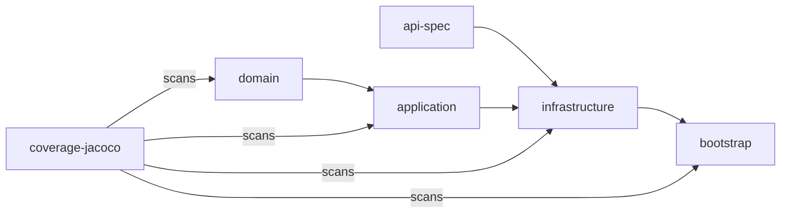
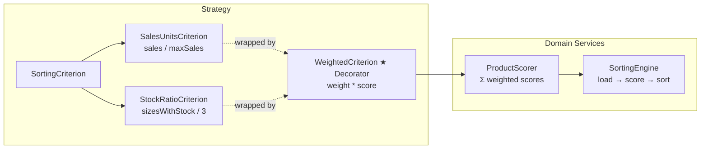
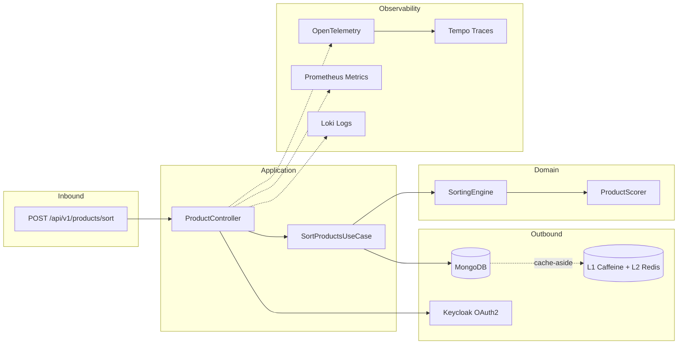

[](LICENSE)

<p align="center">
  <a href="https://sonarcloud.io/summary/new_code?id=acidtango_product-sorter"></a>
  <a href="https://sonarcloud.io/summary/new_code?id=acidtango_product-sorter"></a>
  <a href="https://sonarcloud.io/summary/new_code?id=acidtango_product-sorter"></a>
  <a href="https://sonarcloud.io/summary/new_code?id=acidtango_product-sorter"></a>
  <a href="https://sonarcloud.io/summary/new_code?id=acidtango_product-sorter"></a>
</p>

<p align="center">
  <a href="https://github.com/acidtango/product-sorter/actions/workflows/ci.yml"></a>
  <a href="https://github.com/acidtango/product-sorter/actions/workflows/pages.yml"></a>
  <a href="https://github.com/acidtango/product-sorter/actions/workflows/release.yml"></a>
</p>

---

<p align="center">
  <a href="https://alistair.cockburn.us/hexagonal-architecture/"></a>
  <a href="https://spring.io/projects/spring-boot"></a>
  <a href="https://www.mongodb.com/"></a>
  <a href="https://redis.io/"></a>
  <a href="https://openid.net/connect/"></a>
  <a href="https://opentelemetry.io/"></a>
  <a href="https://www.openapis.org/"></a>
</p>

---

**Product Sorter** is a REST service that sorts a product catalog by weighted scoring criteria (
sales units, stock ratio). Built with hexagonal (ports & adapters) architecture on Java 25, Spring
Boot 4.1, and Maven multi-module.

---

## Architecture

### Modules

| Module            | Description                                                                    |
|-------------------|--------------------------------------------------------------------------------|
| `api-spec`        | OpenAPI 3.1 contract to generated Spring interfaces via openapi-generator      |
| `domain`          | Pure Java. Zero framework dependencies. VOs, Aggregate, Domain Services, Ports |
| `application`     | Use case orchestrating domain logic through inbound/outbound ports             |
| `infrastructure`  | REST controller, MongoDB persistence, L1/L2 cache, OAuth2 security, SpringDoc  |
| `bootstrap`       | Spring Boot composition root. Wires modules, application config                |
| `testdata`        | CLI tool for generating 50k realistic products (power-law, deterministic)      |
| `coverage-jacoco` | JaCoCo aggregated coverage + ArchUnit hexagonal architecture tests             |

### Layer Constraints



- `domain` is pure Java — zero Spring imports. Enforced by ArchUnit (7 rules).
- `application` depends only on `domain` (no framework, no infrastructure).
- `infrastructure` implements domain ports (MongoDB, REST, Redis, Keycloak).
- `bootstrap` is the composition root.

### Sorting Strategy



### Data Flow



### Caching (L1 + L2)

```
score(key) → Caffeine (30s TTL, max 1000) → Redis (5min TTL)
```

Cache keys: `product:score:{id}:{criterion}`, `product:maxSales`, `product:catalog:version`.

Invalidation via `@CacheEvict(allEntries=true)` + versioned catalog.

---

## Quick Start

```bash
# Prerequisites: JDK 25, Maven 3.9+, Docker
git clone https://github.com/acidtango/product-sorter.git
cd product-sorter
```

### Build & Test

```bash
mvn clean verify                                   # Full CI: test + coverage + checkstyle + enforcer
mvn test -pl domain                                # Domain unit tests only (28 cases)
mvn test -pl application -am                       # Application tests
mvn test -pl coverage-jacoco -am                   # ArchUnit + E2E tests
```

### Run (full stack)

```bash
# Start MongoDB, Redis, Keycloak, OTel/Prometheus/Tempo/Loki/Grafana
docker compose up -d

# Build and run
mvn package -pl bootstrap -am -DskipTests
java -jar bootstrap/target/bootstrap-*.jar --spring.profiles.active=docker
```

### Generate test data (50k products)

```bash
mvn package -pl testdata -am -DskipTests
java -jar testdata/target/testdata-*.jar 50000 /tmp/seed.json --seed 42
```

### API

```bash
# Get JWT from keycloak
TOKEN=$(curl -s -X POST http://localhost:8081/realms/product-sorter/protocol/openid-connect/token \
  -d "client_id=app" -d "username=user" -d "password=pass" -d "grant_type=password" \
  | jq -r '.access_token')

# Sort products
curl -s -X POST http://localhost:8080/api/v1/products/sort \
  -H "Authorization: Bearer $TOKEN" \
  -H "Content-Type: application/json" \
  -d '{"weights": {"salesUnits": 0.7, "stockRatio": 0.3}}' | jq
```

---

## API

| Method | Path                    | Auth       | Description                                    |
|--------|-------------------------|------------|------------------------------------------------|
| `GET`  | `/api/v1/products`      | Bearer JWT | List products (paginated: `page`, `size`)      |
| `POST` | `/api/v1/products/sort` | Bearer JWT | Sort products by weighted criteria (paginated) |
| `GET`  | `/swagger-ui.html`      | No         | OpenAPI docs (SpringDoc)                       |
| `GET`  | `/actuator/health`      | No         | Health check                                   |
| `GET`  | `/actuator/prometheus`  | No         | Prometheus metrics                             |

### Request

```json
{
  "weights": {
    "salesUnits": 0.7,
    "stockRatio": 0.3
  }
}
```

### Response

```json
{
  "sortedProducts": [
    {
      "id": 5,
      "name": "CONTRASTING LACE T-SHIRT",
      "score": 0.87
    },
    {
      "id": 1,
      "name": "V-NECH BASIC SHIRT",
      "score": 0.31
    },
    {
      "id": 3,
      "name": "RAISED PRINT T-SHIRT",
      "score": 0.27
    },
    {
      "id": 2,
      "name": "CONTRASTING FABRIC T-SHIRT",
      "score": 0.24
    },
    {
      "id": 6,
      "name": "SLOGAN T-SHIRT",
      "score": 0.21
    },
    {
      "id": 4,
      "name": "PLEATED T-SHIRT",
      "score": 0.16
    }
  ]
}
```

---

## Testing

| Type         | Tools                         | Cases | Coverage             |
|--------------|-------------------------------|-------|----------------------|
| Unit         | JUnit 5 + Instancio + AssertJ | 28    | Domain >95%          |
| Integration  | Testcontainers + Mockito      | 5     | Infrastructure >80%  |
| E2E          | REST Assured + Testcontainers | 4     | Full pipeline        |
| Architecture | ArchUnit                      | 7     | Hexagonal boundaries |

All tests use `@ParameterizedTest`, AssertJ assertions, and Instancio for data generation.

---

## Quality

| Tool        | Phase           | Fails build?                             |
|-------------|-----------------|------------------------------------------|
| JaCoCo      | verify          | Yes (<85% instruction, <80% branch)      |
| ArchUnit    | test            | Yes                                      |
| Checkstyle  | validate        | No (reports only)                        |
| OpenRewrite | process-sources | No (dry-run)                             |
| Enforcer    | validate        | Yes (Java 25, Maven 3.9+, no duplicates) |
| Commitlint  | PR              | Yes                                      |

---

## CI/CD

| Workflow         | Trigger      | Description                                                |
|------------------|--------------|------------------------------------------------------------|
| `ci.yml`         | PR to main   | `mvn verify` + SonarCloud + dependency review + commitlint |
| `pages.yml`      | Push to main | Maven site + coverage reports to GitHub Pages              |
| `release.yml`    | Tag v*       | Changelog generation + GitHub release                      |
| `commitlint.yml` | PR to main   | Conventional Commits validation                            |
| `dependabot.yml` | Weekly       | Maven, Docker, Compose, Actions updates                    |

---

## Observability

| Service    | Port | Credentials |
|------------|------|-------------|
| Grafana    | 3000 | admin/admin |
| Prometheus | 9090 | —           |
| Tempo      | 3200 | —           |
| Loki       | 3100 | —           |
| Keycloak   | 8081 | admin/admin |

Pre-configured dashboards: JVM metrics, HTTP requests, Redis cache, traces (Tempo), logs (Loki).

---

## Design Decisions

### POST vs GET for sorting

`POST /api/v1/products/sort` uses POST because sorting is a computational
operation (scoring + ordering), not a resource retrieval. The weights map
(`{ salesUnits: 0.7, stockRatio: 0.3 }`) would be fragile as query parameters
and would not scale with additional criteria.

For simple product listing without sorting, use `GET /api/v1/products` with
optional `page` and `size` query parameters.

### Pagination

All collection endpoints are paginated with `page` (1-indexed) and `size`
(max 100) parameters. Responses include `total` and `totalPages` for client
navigation. This prevents unbounded responses when the catalog grows to 50k+
products.

**Why offset-based instead of cursor-based?**
- Products are not inserted/deleted during navigation (stable collection)
- Simpler client implementation
- Sufficient for the expected usage pattern (top-N results)

---

## Conventional Commits

```
<type>(<scope>): <lowercase subject>

Types: feat | fix | docs | style | refactor | perf | test | build | ci | chore | revert
Scopes: api-spec | domain | application | infrastructure | bootstrap | testdata | coverage | docker | ci | config

Examples:
  feat(domain): add stock ratio scoring criterion
  test(domain): parametrize sorting engine with Instancio
  ci(workflows): add commitlint validation
