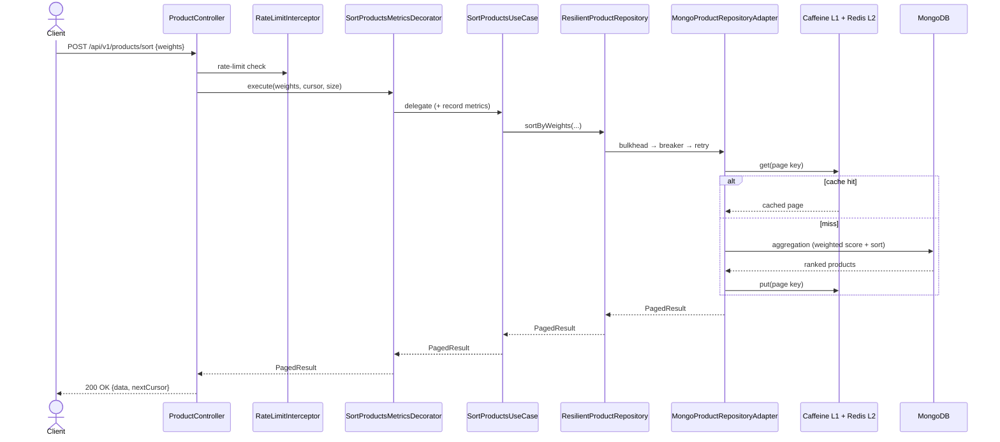
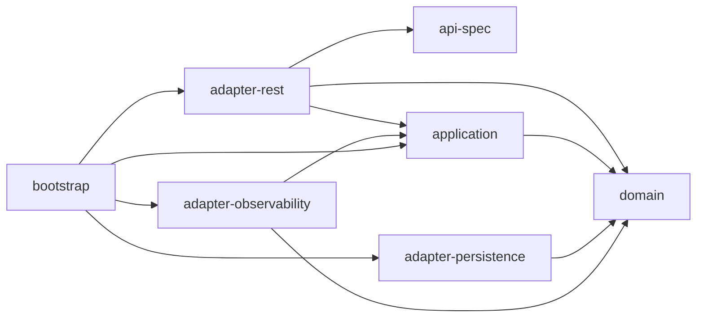
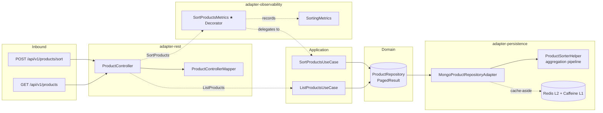
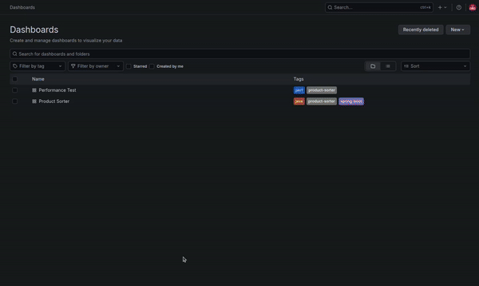

[](https://juanpablojimenezesclusa.github.io/product-sorter/) 
[](LICENSE)

<p align="center">
  <a href="https://sonarcloud.io/summary/new_code?id=JuanPabloJimenezEsclusa_product-sorter"></a>
  <a href="https://sonarcloud.io/summary/new_code?id=JuanPabloJimenezEsclusa_product-sorter"></a>
  <a href="https://sonarcloud.io/summary/new_code?id=JuanPabloJimenezEsclusa_product-sorter"></a>
  <a href="https://sonarcloud.io/summary/new_code?id=JuanPabloJimenezEsclusa_product-sorter"></a>
  <a href="https://sonarcloud.io/summary/new_code?id=JuanPabloJimenezEsclusa_product-sorter"></a>
</p>

<p align="center">
  <a href="https://github.com/JuanPabloJimenezEsclusa/product-sorter/actions/workflows/ci.yml"></a>
  <a href="https://github.com/JuanPabloJimenezEsclusa/product-sorter/actions/workflows/pages.yml"></a>
  <a href="https://github.com/JuanPabloJimenezEsclusa/product-sorter/actions/workflows/codeql.yml"></a>
  <a href="https://github.com/JuanPabloJimenezEsclusa/product-sorter/actions/workflows/chaos.yml"></a>
</p>

---

<p align="center">
  <a href="https://alistair.cockburn.us/hexagonal-architecture/"></a>
  <a href="https://www.openapis.org/"></a>
  <a href="https://spring.io/projects/spring-boot"></a>
  <a href="https://www.mongodb.com/"></a>
  <a href="https://redis.io/"></a>
  <a href="https://openid.net/connect/"></a>
  <a href="https://opentelemetry.io/"></a>
</p>

---

**Product Sorter** is a REST service that sorts a product catalog by weighted scoring criteria (sales units, stock). Built with hexagonal (ports & adapters) architecture on Java, Spring Boot, and Maven multi-module.

---

## Overview

A product category (t-shirts) must be ordered by business relevance. Relevance is a **weighted sum of criteria** — **sales units** and **stock availability across sizes** — where the caller supplies each weight and new criteria can be added over time. The catalog is persisted in MongoDB and the functionality is exposed over REST.

Scores are computed server-side in a MongoDB aggregation pipeline to keep sorting close to the data. See the exact computation on the sample catalog in [Scoring Algorithm → Step-by-step Example](#step-by-step-example).

### Request Flow



## Requirements Traceability

**Core requirements**

| Requirement | Decision | Where |
|-------------|----------|-------|
| Weighted-sum sorting, extensible criteria | Composition of weighted criteria (`AppliedWeights`, `Metrics`) | [Scoring Algorithm](#scoring-algorithm), [ADR-0006](docs/adr/0006-scored-product-composition.md) |
| Sales-units & stock-ratio criteria | Logistic sales ratio + size-availability ratio | [Scoring Algorithm](#scoring-algorithm) |
| Weights received via REST | `POST /api/v1/products/sort` | [ADR-0005](docs/adr/0005-api-design-post-vs-get-and-pagination.md) |
| Java 8+, Spring Boot | Java 25, Spring Boot 4.1 | `pom.xml` |
| Rich domain, no anemia (VOs, Aggregate, services) | Pure `domain` module | [Layer Constraints](#layer-constraints), [ADR-0006](docs/adr/0006-scored-product-composition.md) |
| Hexagonal + tactical DDD, layer separation | Multi-module + ArchUnit rules | [Modules](#modules), [ADR-0008](docs/adr/0008-pure-hexagonal-adapter-naming.md) |
| Tests: unit / integration / E2E (rest-assured) | Three tiers, representative names | [Testing](#testing) |
| MongoDB persistence | Aggregation-pipeline adapter | [ADR-0001](docs/adr/0001-use-mongodb.md) |
| Patterns in sorting criteria | Weighted-criteria composition | [Scoring Algorithm](#scoring-algorithm) |
| No smells / no Spanish / no dead code | Checkstyle + OpenRewrite + test conventions | [Quality](#quality), [Testing](#testing) |

**Beyond the requirements (extra mile)**

| Capability | Implementation | Where |
|------------|----------------|-------|
| Multi-tier cache (L1 + L2) | Caffeine + Redis, cache-aside | [Caching](#caching-l1--l2), [ADR-0002](docs/adr/0002-use-multi-tier-cache.md) |
| API security | OAuth2 / OIDC resource server | [ADR-0003](docs/adr/0003-use-oauth2-oidc.md) |
| Virtual threads | Project Loom for blocking I/O | [ADR-0004](docs/adr/0004-use-virtual-threads.md) |
| Cursor-based pagination | Opaque `score:id` cursor | [Pagination](#pagination), [ADR-0005](docs/adr/0005-api-design-post-vs-get-and-pagination.md) |
| Observability | Micrometer + OpenTelemetry + MDC (Prometheus / Tempo / Loki / Grafana) | [Business Metrics](#business-metrics-micrometer), [ADR-0007](docs/adr/0007-observability-decorator-and-mdc.md) |
| Resilience | Retry / circuit breaker / bulkhead / rate limiter | [Resilience](#resilience-resilience4j), [ADR-0009](docs/adr/0009-resilience-and-timeout-strategy.md) |
| API-first contract | OpenAPI 3.1 → generated Spring interfaces | [Modules](#modules) |
| Quality gates | JaCoCo, ArchUnit, PIT mutation, OWASP, SonarCloud | [Quality](#quality) |
| CI/CD | GitHub Actions (CI, CodeQL, Pages, commitlint), Dependabot | [CI/CD](#cicd) |
| Performance testing | k6 load scenarios (10k → 1M) | [Testing](#testing) |

---

## Architecture

### Modules

| Module | Description |
|--------|-------------|
| `api-spec` | OpenAPI 3.1 contract to generated Spring interfaces via openapi-generator |
| `domain` | Pure Java. Zero framework dependencies. VOs, Aggregate, Metrics, Outbound Ports |
| `application` | Input Ports + use case implementations orchestrating domain logic |
| `adapter-rest` | REST controller, DTO mapping, OAuth2 security, OpenAPI docs, exception handling |
| `adapter-persistence` | MongoDB persistence adapter with aggregation pipeline, L1 Caffeine + L2 Redis caching |
| `adapter-observability` | Metrics decorator, Micrometer business metrics, MdcFilter (traceId, requestUri, X-Request-Id) |
| `bootstrap` | Spring Boot composition root. Wires modules, application config |
| `coverage-jacoco` | JaCoCo aggregated coverage + ArchUnit hexagonal architecture tests |

### Dependency Graph



### Layer Constraints

- `domain` is pure Java — zero Spring imports.
- `application` depends only on `domain` (no framework, no adapters).
- `adapter-persistence` depends only on `domain` (outbound adapter).
- `adapter-observability` depends on `domain` and `application` (metrics decorator wrapping application input ports).
- `adapter-rest` depends on `api-spec`, `application`, and `domain` (inbound adapter).
- `bootstrap` is the composition root.

### Domain Model

```
domain/
├── model/
│   ├── Product              ← Aggregate: id, name, salesUnits, stock, weightedScore (transient)
│   ├── Metrics              ← Enum: SALES_UNITS, STOCK with key mapping and validation
│   └── AppliedWeights       ← Value object: salesUnitsWeight, stockWeight with fromMap()
├── port/
│   └── ProductRepository    ← Outbound port with PagedResult contract
└── vo/
    ├── ProductId, ProductName, SalesUnits, Size, Stock, StockBySize
    └── CursorCodec          ← Base64 cursor encode/decode
```

### Sorting Strategy

Scoring is delegated to a MongoDB aggregation pipeline for `O(sort)` scalability. The domain defines *what* metrics exist and *how* weights are structured; the adapter translates weights into aggregation stages.

| Responsibility | Layer |
|---------------|-------|
| Metric definitions + weight validation | `domain` (Metrics, AppliedWeights) |
| Raw value computation (sales, stock ratio) | `domain` (Stock.stockRatio, SalesUnits.value) |
| Weighted score formula & aggregation | `adapter-persistence` (MongoQueryHelper) |
| Cursor-based pagination | `application` (PagedResult, size+1 detection) |

The domain does **not** compute final scores in-memory. The adapter translates weights into a MongoDB aggregation pipeline that uses top-K heap sort:

```javascript
// w_sales=0.7, w_stock=0.3, midpoint=50, cursor=null, size=20
db.products.aggregate([
  // ── Compute weighted score per document ──
  { $addFields: {
    weightedScore: {
      $add: [
        { $multiply: [
          { $divide: ["$salesUnits", { $add: ["$salesUnits", 50] }] },
          0.7
        ]},
        { $multiply: ["$stockRatio", 0.3] }
      ]
    }
  }},

  // ── Sort by score descending (tiebreaker: _id) ──
  { $sort: { weightedScore: -1, _id: -1 } },

  // ── Top-K: heap sort only keeps top N, O(N log K) ──
  { $limit: 21 }  // size+1 to detect hasMore
], { allowDiskUse: true })
```

For cursor-based pagination (second page), a `$match` stage is inserted between `$sort` and `$limit`:

```javascript
{ $match: {
  $or: [
    { weightedScore: { $lt: 70.2 } },
    { weightedScore: 70.2, _id: { $lt: "1" } }
  ]
}}
```

MongoDB top-K optimization: `$sort` + `$limit` uses an in-memory heap of size K instead of sorting the entire collection. Pagination uses `nextCursor` (null = end of results) instead of tracking a `total` count, removing one extra collection scan per request.

### Data Flow



### Caching (L1 + L2)

```
get(k) → Caffeine (30s TTL, max 100) → miss → Redis (300s TTL) → miss → MongoDB
```

`MultiTierCache` wraps Caffeine (L1) and Redis (L2). On read: checks L1 first, then L2, populates L1 on L2 hit. On write: writes to both tiers.

Cache namespace: `productCache`. First-page requests (cursor=null) are cached by limit size. Subsequent pages with unique cursors bypass the cache.

### Pagination

Both endpoints use cursor-based pagination instead of offset-based (`$skip`). This ensures `O(1)` page access regardless of depth:

| Field | Description |
|-------|-------------|
| `cursor` | Base64-encoded `score:productId` (optional, null = first page) |
| `size` | Items per page (default 20, max 100) |
| `nextCursor` | Opaque token for next page (null = last page) |

The repository returns `size + 1` items. The use case detects `hasMore` when result exceeds `size`, trims the extra item, and computes `nextCursor` from the last visible product.

### Business Metrics (Micrometer)

| Metric | Type | Tags | Description |
|--------|------|------|-------------|
| `sorting_requests_total` | Counter | — | Total sort requests |
| `sorting_duration_seconds` | Timer (p50, p95, p99) | — | Sort execution time |
| `sorting_products` | DistributionSummary (p50, p95, p99) | — | Products per sort |
| `sorting_weights` | DistributionSummary | `criterion` | Sales/stock weights used |

### Resilience (Resilience4j)

Fault tolerance is applied at each outbound boundary as **decorators**, keeping domain/application framework-free:

| Boundary | Strategy | Degradation |
|----------|----------|-------------|
| MongoDB (`ResilientProductRepository`) | Bulkhead → CircuitBreaker → Retry | Open/full → fail fast `503` |
| Redis L2 (`ResilientCache`) | CircuitBreaker | Open → cache miss (fall back to MongoDB) |
| JWKS fetch (`JwtDecoderResilienceConfig`) | Retry + timeouts | Transient fetch retried |
| REST ingress (`RateLimitInterceptor`) | RateLimiter | Over limit → `429` |

Retry covers connectivity/failover only (never timeouts); the breaker is time-based and slow-call-aware; the bulkhead sits above concurrency and below the Mongo pool.

---

## Scoring Algorithm

Products are sorted by a weighted sum of normalized metric values. Both criteria are normalized to the [0, 1] range. Sales units use a logistic saturation function (`x / (x + midpoint)`). Stock uses a binary availability ratio. Final scores are computed in MongoDB via an aggregation pipeline.

### Criterion: Sales Units

```
salesRatio(product) = product.salesUnits / (product.salesUnits + midpoint)
```

Uses logistic normalization (`x / (x + K)`) with configurable `midpoint` (default 50). At `salesUnits = midpoint`, the ratio is 0.5. ∈ [0, 1). No dependency on max sales or the full dataset.

### Criterion: Stock Ratio

```
stockRatio(product) = count(sizes where quantity > 0) / totalSizes()
                      0 if stock is empty
```

Measures size availability: what fraction of the product's sizes are in stock. ∈ [0, 1].

### Weighted Sum

```
weightedScore(product) = w_sales × salesRatio + w_stock × stockRatio
```

Both criteria are now in the same [0, 1] range. Weights determine their relative contribution to the final score.

### Step-by-step Example

Using the dataset with `weights = { salesUnits: 0.7, stockRatio: 0.3 }` and `midpoint = 50`:

| # | Name | Sales | S | M | L | Sales Ratio | Stock Ratio | Weighted Score |
|---|------|-------|----|----|----|-------------|-------------|----------------|
| 1 | V-NECH BASIC SHIRT | 100 | 4 | 9 | 0 | 100/(100+50) = 0.667 | 2/3 | 0.7×0.667 + 0.3×(2/3) = **0.667** |
| 2 | CONTRASTING FABRIC T-SHIRT | 50 | 35 | 9 | 9 | 50/(50+50) = 0.500 | 3/3 = 1.0 | 0.7×0.500 + 0.3×1.0 = **0.650** |
| 3 | RAISED PRINT T-SHIRT | 80 | 20 | 2 | 20 | 80/(80+50) = 0.615 | 3/3 = 1.0 | 0.7×0.615 + 0.3×1.0 = **0.731** |
| 4 | PLEATED T-SHIRT | 3 | 25 | 30 | 10 | 3/(3+50) = 0.057 | 3/3 = 1.0 | 0.7×0.057 + 0.3×1.0 = **0.340** |
| 5 | CONTRASTING LACE T-SHIRT | 650 | 0 | 1 | 0 | 650/(650+50) = 0.929 | 1/3 | 0.7×0.929 + 0.3×(1/3) = **0.750** |
| 6 | SLOGAN T-SHIRT | 20 | 9 | 2 | 5 | 20/(20+50) = 0.286 | 3/3 = 1.0 | 0.7×0.286 + 0.3×1.0 = **0.500** |

**Sorted result (descending score):**

| Position | ID | Name | Score |
|----------|----|------|-------|
| 1 | 5 | CONTRASTING LACE T-SHIRT | **0.750** |
| 2 | 3 | RAISED PRINT T-SHIRT | **0.731** |
| 3 | 1 | V-NECH BASIC SHIRT | **0.667** |
| 4 | 2 | CONTRASTING FABRIC T-SHIRT | **0.650** |
| 5 | 6 | SLOGAN T-SHIRT | **0.500** |
| 6 | 4 | PLEATED T-SHIRT | **0.340** |

---

## Quick Start

```bash
# Prerequisites: JDK 25, Maven 3.9+, Docker
git clone https://github.com/JuanPabloJimenezEsclusa/product-sorter.git
cd product-sorter
```

### Build & Test

```bash
mvn clean verify                     # Full CI: test + coverage + checkstyle + enforcer
mvn test -pl domain                  # Domain unit tests + PIT mutation testing
mvn test -P pitest -pl domain        # PIT mutation testing (97% mutation coverage)
mvn test -pl application -am         # Application tests
mvn test -pl adapter-rest -am        # Adapter tests
mvn test -pl adapter-persistence -am # Integration tests (MongoDB via Testcontainers)
mvn test -pl coverage-jacoco -am     # ArchUnit architecture tests
mvn clean verify -Psecurity          # With OWASP Dependency-Check
```

### Docker Compose Deployment

#### Option 1 — Local dev (app on host)

```bash
mvn package -pl bootstrap -am -DskipTests
java -jar bootstrap/target/bootstrap-*.jar --spring.profiles.active=docker-compose
```

#### Option 2 — Fully containerized (Docker Compose)

```bash
docker compose --profile app up --build
```

#### Architecture


| Service                               | Auth                  |
|---------------------------------------|-----------------------|
| [API](http://localhost:8880)          | Bearer JWT (Keycloak) |
| [Grafana](http://localhost:3000)      | `admin` / `admin`     |
| [Prometheus](http://localhost:9090)   | —                     |
| [Alertmanager](http://localhost:9093) | —                     |
| [Keycloak](http://localhost:8081)     | `admin` / `admin`     |
| [RedisInsight](http://localhost:5540) | —                     |



### AWS Deployment

Production-ready ECS Fargate stack — CloudFormation (3 stacks), Cognito, Secrets Manager, ALB + ACM + Route53, VPC with NAT Gateway, FARGATE_SPOT. ~$70/month. See [deploy/aws/](deploy/aws/Readme.md).

### Generate test data

```txt
mvn test-compile exec:java -pl adapter-persistence \
  -Dexec.mainClass="dev.jpje.productsorter.adapter.persistence.datagen.ProductDataGenerator" \
  -Dexec.classpathScope=test \
  -Dexec.args="<count> <output.json>"
```

```bash
# Example: 250000 products
mvn test-compile exec:java -pl adapter-persistence \
  -Dexec.mainClass="dev.jpje.productsorter.adapter.persistence.datagen.ProductDataGenerator" \
  -Dexec.classpathScope=test \
  -Dexec.args="250000 /tmp/products.json"
```

---

## API

| Method | Path | Auth | Description |
|--------|------|------|-------------|
| `POST` | `/api/v1/products/sort` | Bearer JWT | Sort products by weighted criteria (cursor-based pagination) |
| `GET` | `/api/v1/products` | Bearer JWT | List products (cursor-based pagination) |

### Sort Request

```bash
TOKEN=$(curl -s -X POST http://localhost:8081/realms/product-sorter/protocol/openid-connect/token \
  -d "client_id=product-sorter-client" -d "client_secret=product-sorter-secret" \
  -d "username=user" -d "password=pass" -d "grant_type=password" | jq -r '.access_token')
  
# First page (no cursor)
curl -s -X POST "http://localhost:8880/api/v1/products/sort?size=20" \
  -H "Authorization: Bearer ${TOKEN}" \
  -H "Content-Type: application/json" \
  -d '{"weights": {"salesUnits": 0.7, "stockRatio": 0.3}}' | jq

# Next page (with cursor from previous response)
curl -s -X POST "http://localhost:8880/api/v1/products/sort?cursor=...&size=20" \
  -H "Authorization: Bearer ${TOKEN}" \
  -H "Content-Type: application/json" \
  -d '{"weights": {"salesUnits": 0.7, "stockRatio": 0.3}}' | jq
```

### Sort Response

```json
{
  "data": [
    {
      "id": "550e8400-e29b-41d4-a716-446655440000",
      "name": "CONTRASTING LACE T-SHIRT",
      "salesUnits": 650,
      "stock": [
        { "size": "S", "quantity": 0 },
        { "size": "M", "quantity": 1 },
        { "size": "L", "quantity": 0 }
      ],
      "score": 455.1
    }
  ],
  "size": 20,
  "nextCursor": "NDU1LjE6NQ=="
}
```

### List Products Request

```bash
# First page
curl -s "http://localhost:8880/api/v1/products?size=10" \
  -H "Authorization: Bearer ${TOKEN}" | jq

# Next page
curl -s "http://localhost:8880/api/v1/products?cursor=...&size=10" \
  -H "Authorization: Bearer ${TOKEN}" | jq
```

### List Products Response

```json
{
  "data": [
    {
      "id": "550e8400-e29b-41d4-a716-446655440000",
      "name": "V-NECH BASIC SHIRT",
      "salesUnits": 100,
      "stock": [
        { "size": "S", "quantity": 4 },
        { "size": "M", "quantity": 9 },
        { "size": "L", "quantity": 0 }
      ],
      "score": null
    }
  ],
  "size": 10,
  "nextCursor": "MC4wOjY="
}
```

---

## Testing

| Type | Tools | Cases |
|------|-------|-------|
| Unit | JUnit 5 + Instancio + AssertJ | domain model + value objects |
| Unit (mutation) | PIT Mutation Testing | 97% mutation score on domain |
| Application | JUnit 5 + Instancio + Mockito | use cases with cursor pagination |
| Integration | Testcontainers (MongoDB 8) | aggregation pipeline + pagination + mapper |
| Cache | Mockito | MultiTierCache + CompositeCacheManager |
| Resilience | JUnit 5 + Resilience4j | retry, circuit breaker, bulkhead, rate limiter |
| Observability | Mockito + Micrometer | metrics, decorator, MDC filter |
| Adapter | Mockito | controller + mapper |
| Architecture | ArchUnit | hexagonal boundary rules |
| E2E | Testcontainers + REST Assured | full HTTP stack: sort + paginate with cursor |
| Contract | REST Assured + JSON Schema | API response matches OpenAPI spec |
| Chaos | Testcontainers + Toxiproxy + MockWebServer | fault injection: fail-fast, degradation, recovery (`-Pchaos`, [chaos/](chaos/README.md)) |
| Performance | k6 | Load scenarios (10k, 100k, 1M products), see [perf/](perf/) |

---

## Quality

| Tool | Phase | Fails build? |
|------|-------|--------------|
| JaCoCo | verify | Yes (>85% instruction, >80% branch) |
| ArchUnit | test | Yes |
| Checkstyle | validate | No (reports only) |
| OpenRewrite | process-sources | No (dry-run) |
| Enforcer | validate | Yes (Java 25, Maven 3.9+, no duplicates) |
| Commitlint | PR | Yes (Conventional Commits) |
| OWASP Dep-Check | verify (with `-Psecurity`) | Yes (CVSS >= 7) |
| PIT Mutation | test (with `-Ppitest`) | Yes (>= 70% mutation score) |

---

## CI/CD

| Workflow | Trigger | Description |
|----------|---------|-------------|
| `ci.yml` | PR to `develop` | `mvn verify` + SonarCloud + dependency review |
| `codeql.yml` | PR + push to `develop` + weekly | GitHub CodeQL security analysis |
| `commitlint.yml` | PR to `develop` | Conventional Commits validation |
| `pages.yml` | Push to `develop` | Maven site + coverage reports to GitHub Pages |
| `dependabot.yml` | Weekly | Maven, Docker, Compose, Actions updates |
| `chaos.yml` | Weekly + manual | Chaos/resilience tests (`-Pchaos`) |

---

## Architecture Decision Records

All significant design decisions are documented as ADRs in [`docs/adr/`](docs/adr/):

| ADR | Title |
|-----|-------|
| [ADR-0001](docs/adr/0001-use-mongodb.md) | MongoDB as primary database + UUID as `_id` |
| [ADR-0002](docs/adr/0002-use-multi-tier-cache.md) | Caffeine L1 + Redis L2 multi-tier cache |
| [ADR-0003](docs/adr/0003-use-oauth2-oidc.md) | OAuth 2.0 / OIDC for API authentication |
| [ADR-0004](docs/adr/0004-use-virtual-threads.md) | Virtual threads (Project Loom) |
| [ADR-0005](docs/adr/0005-api-design-post-vs-get-and-pagination.md) | POST for sorting + cursor-based pagination |
| [ADR-0006](docs/adr/0006-scored-product-composition.md) | ScoredProduct composition over field duplication |
| [ADR-0007](docs/adr/0007-observability-decorator-and-mdc.md) | Decorator pattern for metrics + MDC correlation |
| [ADR-0008](docs/adr/0008-pure-hexagonal-adapter-naming.md) | Pure hexagonal adapter naming convention |
| [ADR-0009](docs/adr/0009-resilience-and-timeout-strategy.md) | Resilience4j decorators + timeout strategy |

---

## Conventional Commits

```
<type>(<scope>): <lowercase subject>

Types: feat | fix | docs | style | refactor | perf | test | build | ci | chore | revert
Scopes: api-spec | domain | application | adapter | bootstrap | testdata | coverage | docker | ci | config

Examples:
  feat(domain): add stockRatio binary availability criterion
  refactor(adapter): replace in-memory sorting with aggregation pipeline
  test(domain): parametrize stock ratio with Instancio
  ci(workflows): add commitlint validation
```
