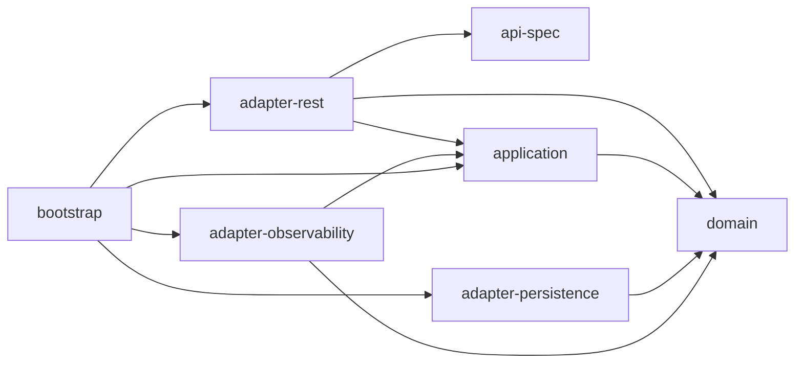
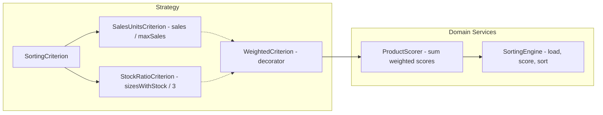
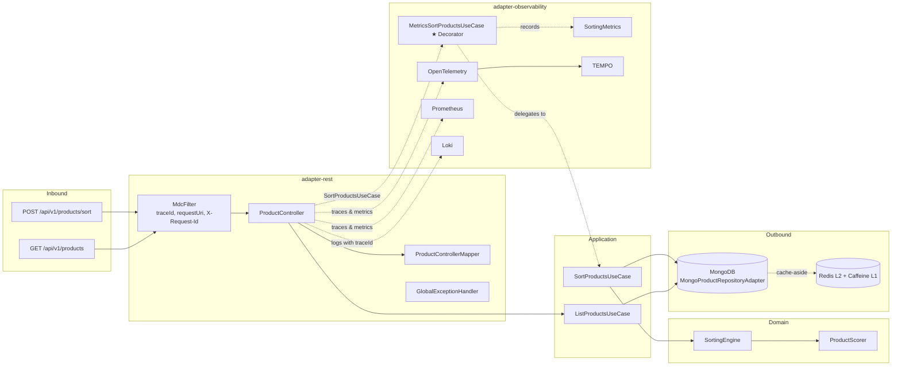

[](https://juanpablojimenezesclusa.github.io/product-sorter/) 
[](LICENSE)

<p align="center">
  <a href="https://sonarcloud.io/summary/new_code?id=JuanPabloJimenezEsclusa_product-sorter"></a>
  <a href="https://sonarcloud.io/summary/new_code?id=JuanPabloJimenezEsclusa_product-sorter"></a>
  <a href="https://sonarcloud.io/summary/new_code?id=JuanPabloJimenezEsclusa_product-sorter"></a>
  <a href="https://sonarcloud.io/summary/new_code?id=JuanPabloJimenezEsclusa_product-sorter"></a>
  <a href="https://sonarcloud.io/summary/new_code?id=JuanPabloJimenezEsclusa_product-sorter"></a>
</p>

<p align="center">
  <a href="https://github.com/JuanPabloJimenezEsclusa/product-sorter/actions/workflows/ci.yml"></a>
  <a href="https://github.com/JuanPabloJimenezEsclusa/product-sorter/actions/workflows/pages.yml"></a>
  <a href="https://github.com/JuanPabloJimenezEsclusa/product-sorter/actions/workflows/codeql.yml"></a>
</p>

---

<p align="center">
  <a href="https://alistair.cockburn.us/hexagonal-architecture/"></a>
  <a href="https://spring.io/projects/spring-boot"></a>
  <a href="https://www.mongodb.com/"></a>
  <a href="https://redis.io/"></a>
  <a href="https://openid.net/connect/"></a>
  <a href="https://opentelemetry.io/"></a>
  <a href="https://www.openapis.org/"></a>
</p>

---

**Product Sorter** is a REST service that sorts a product catalog by weighted scoring criteria (sales units, stock ratio). Built with hexagonal (ports & adapters) architecture on Java 25, Spring Boot 4.1, and Maven multi-module.

---

## Architecture

### Modules

| Module | Description |
|--------|-------------|
| `api-spec` | OpenAPI 3.1 contract to generated Spring interfaces via openapi-generator |
| `domain` | Pure Java. Zero framework dependencies. VOs, Aggregate, Domain Services, Outbound Ports |
| `application` | Input Ports + use case implementations orchestrating domain logic |
| `adapter-rest` | REST controller, DTO mapping, OAuth2 security, OpenAPI docs, exception handling |
| `adapter-persistence` | MongoDB persistence adapter, L1 Caffeine + L2 Redis caching |
| `adapter-observability` | Metrics decorator, Micrometer business metrics, MdcFilter (traceId, requestUri, X-Request-Id) |
| `bootstrap` | Spring Boot composition root. Wires modules, application config |
| `coverage-jacoco` | JaCoCo aggregated coverage + ArchUnit hexagonal architecture tests (12 rules) |

### Dependency Graph



### Layer Constraints

- `domain` is pure Java — zero Spring imports. Enforced by ArchUnit.
- `application` depends only on `domain` (no framework, no adapter-persistence).
- `adapter-persistence` depends only on `domain` (outbound adapters: persistence, cache).
- `adapter-observability` depends on `domain` and `application` (metrics decorator wrapping application input ports).
- `adapter-rest` depends on `api-spec`, `application`, and `domain` (inbound adapter).
- `bootstrap` is the composition root.

### Sorting Strategy



### Data Flow



### Caching (L1 + L2)

```
get(k) → Caffeine (30s TTL, max 100) → miss → Redis (120s TTL) → miss → MongoDB
```

`MultiTierCache` wraps Caffeine (L1) and Redis (L2). On read: checks L1 first, then L2, populates L1 on L2 hit. On write: writes to both tiers.

Cache namespace: `productCache` with keys per page (`"1-20"`, `"2-20"`) and keys for scoreable projections (`"scoreables"`).

### Performance Optimization

For large catalogs (250k+ products), sorting uses a two-phase approach:
1. **Projection query:** `findAllScoreable()` fetches only `_id`, `salesUnits`, and `stock` from MongoDB via field projection
2. **Lazy fetch:** only the top 20 products from the sorted result are fetched as full documents via `findByIds()`
3. **Index:** `{salesUnits: -1}` index ensures `findMaxSalesUnits()` is an IXSCAN (1 entry, ~1ms) instead of COLLSCAN

This reduces total sort time from ~540ms to ~165ms for 250k products. Results are cached via `@Cacheable` in Redis L2 (TTL 120s for scoreables, 120s for product pages).

### Business Metrics (Micrometer)

| Metric | Type | Tags | Description |
|--------|------|------|-------------|
| `sorting_requests_total` | Counter | — | Total sort requests |
| `sorting_duration_seconds` | Timer (p50, p95, p99) | — | Sort execution time |
| `sorting_products` | DistributionSummary (p50, p95, p99) | — | Products per sort |
| `sorting_weights` | DistributionSummary | `criterion` | Sales/stock weights used |

---

## Scoring Algorithm

Products are sorted by a weighted sum of criterion scores. Each criterion produces a raw score in [0, 1], weighted by the user-provided weight, then summed for the final score. Products are returned in descending score order.

### Criterion: Sales Units

```
rawScore(product) = product.salesUnits / maxSalesUnits(catalog)
```

Normalises each product's sales against the best-selling product in the catalog.

### Criterion: Stock Ratio

```
rawScore(product) = count(sizes where stock.quantity > 0) / 3
```

Measures availability: how many sizes (S, M, L) have positive stock.

### Weighted Sum

```
finalScore(product) = w_sales × rawScore_sales(product) + w_stock × rawScore_stock(product)
```

Where `w_sales + w_stock = 1` and both are in [0, 1].

### Step-by-step Example

Using the ITX dataset with `weights = { salesUnits: 0.7, stockRatio: 0.3 }`:

| # | Name | Sales | S | M | L | Raw Sales | Raw Stock | Score |
|---|------|-------|----|----|----|-----------|-----------|-------|
| 1 | V-NECH BASIC SHIRT | 100 | 4 | 9 | 0 | 100/650 ≈ 0.154 | 2/3 ≈ 0.667 | 0.7×0.154 + 0.3×0.667 = **0.308** |
| 2 | CONTRASTING FABRIC T-SHIRT | 50 | 35 | 9 | 9 | 50/650 ≈ 0.077 | 3/3 = 1.000 | 0.7×0.077 + 0.3×1.000 = **0.354** |
| 3 | RAISED PRINT T-SHIRT | 80 | 20 | 2 | 20 | 80/650 ≈ 0.123 | 3/3 = 1.000 | 0.7×0.123 + 0.3×1.000 = **0.386** |
| 4 | PLEATED T-SHIRT | 3 | 25 | 30 | 10 | 3/650 ≈ 0.005 | 3/3 = 1.000 | 0.7×0.005 + 0.3×1.000 = **0.303** |
| 5 | CONTRASTING LACE T-SHIRT | 650 | 0 | 1 | 0 | 650/650 = 1.000 | 1/3 ≈ 0.333 | 0.7×1.000 + 0.3×0.333 = **0.800** |
| 6 | SLOGAN T-SHIRT | 20 | 9 | 2 | 5 | 20/650 ≈ 0.031 | 3/3 = 1.000 | 0.7×0.031 + 0.3×1.000 = **0.322** |

**Sorted result (descending score):**

| Position | ID | Name | Score |
|----------|----|------|-------|
| 1 | 5 | CONTRASTING LACE T-SHIRT | **0.800** |
| 2 | 3 | RAISED PRINT T-SHIRT | **0.386** |
| 3 | 2 | CONTRASTING FABRIC T-SHIRT | **0.354** |
| 4 | 6 | SLOGAN T-SHIRT | **0.322** |
| 5 | 1 | V-NECH BASIC SHIRT | **0.308** |
| 6 | 4 | PLEATED T-SHIRT | **0.303** |

---

## Quick Start

```bash
# Prerequisites: JDK 25, Maven 3.9+, Docker
git clone https://github.com/JuanPabloJimenezEsclusa/product-sorter.git
cd product-sorter
```

### Build & Test

```bash
mvn clean verify                     # Full CI: test + coverage + checkstyle + enforcer
mvn test -pl domain                  # Domain unit tests
mvn test -pl application -am         # Application tests
mvn test -pl adapter-rest -am        # Adapter tests
mvn test -pl adapter-persistence -am      # Integration tests (MongoDB via Testcontainers)
mvn test -pl coverage-jacoco -am     # ArchUnit architecture tests
mvn clean verify -Psecurity          # With OWASP Dependency-Check
mvn clean verify -Ppitest            # With PIT mutation testing (domain module)
```

### Run (full stack)

**Option 1 — Local dev (app on host):**

```bash
mvn package -pl bootstrap -am -DskipTests
java -jar bootstrap/target/bootstrap-*.jar --spring.profiles.active=docker-compose
```

**Option 2 — Fully containerized (Docker Compose):**

```bash
docker compose --profile app up --build
```

### Deployment Architecture


### Generate test data

```txt
mvn test-compile exec:java -pl adapter-persistence \
  -Dexec.mainClass="dev.jpje.productsorter.adapter-persistence.datagen.ProductDataGenerator" \
  -Dexec.classpathScope=test \
  -Dexec.args="<count> <output.json>"
```

```bash
# Example: 250000 products
mvn test-compile exec:java -pl adapter-persistence \
  -Dexec.mainClass="dev.jpje.productsorter.adapter-persistence.datagen.ProductDataGenerator" \
  -Dexec.classpathScope=test \
  -Dexec.args="250000 /tmp/products.json"
```

---

## API

| Method | Path | Auth | Description |
|--------|------|------|-------------|
| `POST` | `/api/v1/products/sort` | Bearer JWT | Sort products by weighted criteria (paginated) |
| `GET` | `/api/v1/products` | Bearer JWT | List products (paginated: `page`, `size`) |

### Sort Request

```bash
TOKEN=$(curl -s -X POST http://localhost:8081/realms/product-sorter/protocol/openid-connect/token \
  -d "client_id=product-sorter-client" -d "client_secret=product-sorter-secret" \
  -d "username=user" -d "password=pass" -d "grant_type=password" | jq -r '.access_token')
  
# Sort products with weighted criteria
curl -s -X POST "http://localhost:8880/api/v1/products/sort?page=1&size=20" \
  -H "Authorization: Bearer ${TOKEN}" \
  -H "Content-Type: application/json" \
  -d '{"weights": {"salesUnits": 0.7, "stockRatio": 0.3}}' | jq
```

### Sort Response

```json
{
  "data": [
    {
      "product": { 
        "id": "550e8400-e29b-41d4-a716-446655440000", 
        "name": "CONTRASTING LACE T-SHIRT", 
        "salesUnits": 650, 
        "stock": [
          { "size": "S", "quantity": 0 }, 
          { "size": "M", "quantity": 1 }, 
          { "size": "L", "quantity": 0 }]},
      "score": 0.87
    }
  ],
  "page": 1,
  "size": 20
}
```

### List Products Request

```bash
# List products (paginated)
curl -s "http://localhost:8880/api/v1/products?page=1&size=10" \
  -H "Authorization: Bearer ${TOKEN}" | jq
```

### List Products Response

```json
{
  "data": [
    { 
      "id": "550e8400-e29b-41d4-a716-446655440000", 
      "name": "V-NECH BASIC SHIRT", 
      "salesUnits": 100, 
      "stock": [
        { "size": "S", "quantity": 4 },
        { "size": "M", "quantity": 9 },
        { "size": "L", "quantity": 0 }]},
    { 
      "id": "6fa459ea-ee8a-3ca5-8b4a-22e3b2a5b4c6", 
      "name": "CONTRASTING FABRIC T-SHIRT", 
      "salesUnits": 50, 
      "stock": [
        { "size": "S", "quantity": 35 }, 
        { "size": "M", "quantity": 9 }, 
        { "size": "L", "quantity": 9 }]}],
  "page": 1,
  "size": 10
}
```

---

## Testing

| Type | Tools | Cases                                |
|------|-------|--------------------------------------|
| Unit | JUnit 5 + Instancio + AssertJ | domain model + services              |
| Application | JUnit 5 + Instancio + Mockito | use cases with pagination            |
| Integration | Testcontainers (MongoDB 8) | persistence + mapper edge cases      |
| Cache | Mockito | MultiTierCache + CompositeCacheManager |
| Observability | Mockito + Micrometer + Spring Mock | metrics, decorator, MDC filter       |
| Adapter | Mockito | controller + mapper               |
| Architecture | ArchUnit | hexagonal boundary rules           |

---

## Quality

| Tool | Phase | Fails build?                            |
|------|-------|-----------------------------------------|
| JaCoCo | verify | Yes (>85% instruction, >80% branch)     |
| ArchUnit | test | Yes                           |
| Checkstyle | validate | No (reports only)                       |
| OpenRewrite | process-sources | No (dry-run)                            |
| Enforcer | validate | Yes (Java 25, Maven 3.9+, no duplicates) |
| Commitlint | PR | Yes (Conventional Commits)              |
| OWASP Dep-Check | verify (with `-Psecurity`) | Yes (CVSS ≥ 7)                          |
| PIT Mutation | test (with `-Ppitest`) | Yes (80% mutation score)                |

---

## CI/CD

| Workflow | Trigger | Description |
|----------|---------|-------------|
| `ci.yml` | PR to `develop` | `mvn verify` + SonarCloud + dependency review |
| `codeql.yml` | PR + push to `develop` + weekly | GitHub CodeQL security analysis |
| `commitlint.yml` | PR to `develop` | Conventional Commits validation |
| `pages.yml` | Push to `develop` | Maven site + coverage reports to GitHub Pages |
| `dependabot.yml` | Weekly | Maven, Docker, Compose, Actions updates |

---

## Observability

| Service | Port | Credentials |
|---------|------|-------------|
| Grafana | 3000 | admin/admin |
| Prometheus | 9090 | — |
| Tempo | 3200 | — |
| Loki | 3100 | — |
| Keycloak | 8081 | admin/admin |

---

## Architecture Decision Records

All significant design decisions are documented as ADRs in [`docs/adr/`](docs/adr/):

| ADR | Title |
|-----|-------|
| [ADR-0001](docs/adr/0001-use-mongodb.md) | MongoDB as primary database + UUID as `_id` |
| [ADR-0002](docs/adr/0002-use-multi-tier-cache.md) | Caffeine L1 + Redis L2 multi-tier cache |
| [ADR-0003](docs/adr/0003-use-oauth2-oidc.md) | OAuth 2.0 / OIDC for API authentication |
| [ADR-0004](docs/adr/0004-use-virtual-threads.md) | Virtual threads (Project Loom) |
| [ADR-0005](docs/adr/0005-api-design-post-vs-get-and-pagination.md) | POST for sorting + offset-based pagination |
| [ADR-0006](docs/adr/0006-scored-product-composition.md) | ScoredProduct composition over field duplication |
| [ADR-0007](docs/adr/0007-observability-decorator-and-mdc.md) | Decorator pattern for metrics + MDC correlation |
| [ADR-0008](docs/adr/0008-pure-hexagonal-adapter-naming.md) | Pure hexagonal adapter naming convention |

---

## Conventional Commits

```
<type>(<scope>): <lowercase subject>

Types: feat | fix | docs | style | refactor | perf | test | build | ci | chore | revert
Scopes: api-spec | domain | application | adapter-persistence | adapter-observability | adapter-rest | bootstrap | coverage | docker | ci | config

Examples:
  feat(domain): add stock ratio scoring criterion
  test(domain): parametrize sorting engine with Instancio
  ci(workflows): add commitlint validation
