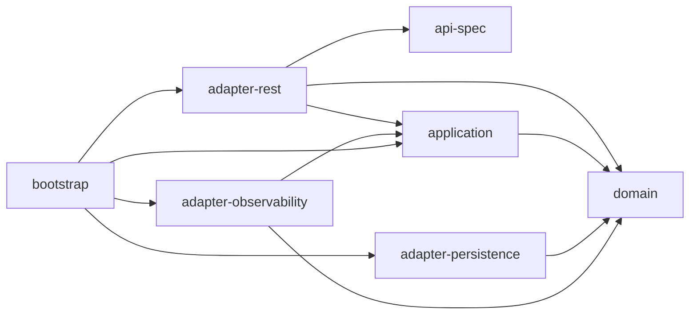
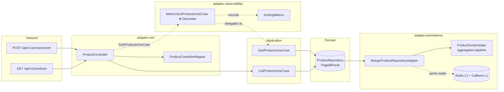
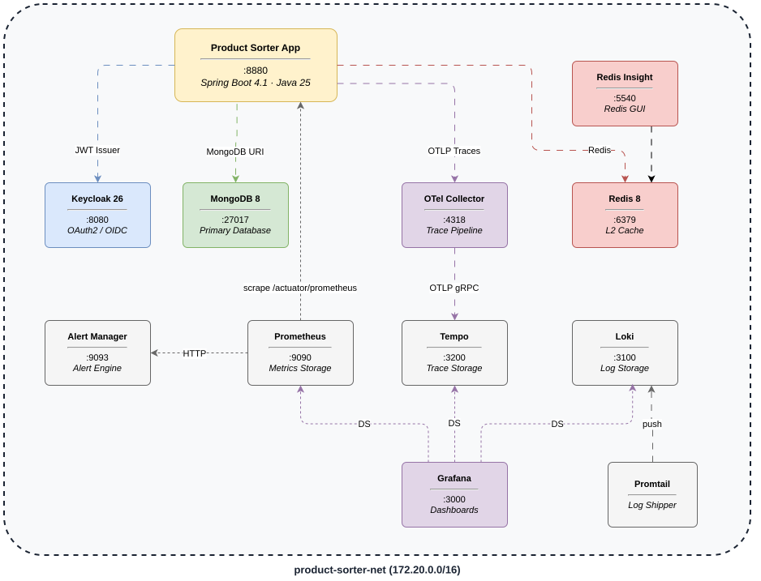

[](https://juanpablojimenezesclusa.github.io/product-sorter/) 
[](LICENSE)

<p align="center">
  <a href="https://sonarcloud.io/summary/new_code?id=JuanPabloJimenezEsclusa_product-sorter"></a>
  <a href="https://sonarcloud.io/summary/new_code?id=JuanPabloJimenezEsclusa_product-sorter"></a>
  <a href="https://sonarcloud.io/summary/new_code?id=JuanPabloJimenezEsclusa_product-sorter"></a>
  <a href="https://sonarcloud.io/summary/new_code?id=JuanPabloJimenezEsclusa_product-sorter"></a>
  <a href="https://sonarcloud.io/summary/new_code?id=JuanPabloJimenezEsclusa_product-sorter"></a>
</p>

<p align="center">
  <a href="https://github.com/JuanPabloJimenezEsclusa/product-sorter/actions/workflows/ci.yml"></a>
  <a href="https://github.com/JuanPabloJimenezEsclusa/product-sorter/actions/workflows/pages.yml"></a>
  <a href="https://github.com/JuanPabloJimenezEsclusa/product-sorter/actions/workflows/codeql.yml"></a>
</p>

---

<p align="center">
  <a href="https://alistair.cockburn.us/hexagonal-architecture/"></a>
  <a href="https://spring.io/projects/spring-boot"></a>
  <a href="https://www.mongodb.com/"></a>
  <a href="https://redis.io/"></a>
  <a href="https://openid.net/connect/"></a>
  <a href="https://opentelemetry.io/"></a>
  <a href="https://www.openapis.org/"></a>
</p>

---

**Product Sorter** is a REST service that sorts a product catalog by weighted scoring criteria (sales units, stock). Built with hexagonal (ports & adapters) architecture on Java 25, Spring Boot 4.1, and Maven multi-module.

---

## Architecture

### Modules

| Module | Description |
|--------|-------------|
| `api-spec` | OpenAPI 3.1 contract to generated Spring interfaces via openapi-generator |
| `domain` | Pure Java. Zero framework dependencies. VOs, Aggregate, Metrics, Outbound Ports |
| `application` | Input Ports + use case implementations orchestrating domain logic |
| `adapter-rest` | REST controller, DTO mapping, OAuth2 security, OpenAPI docs, exception handling |
| `adapter-persistence` | MongoDB persistence adapter with aggregation pipeline, L1 Caffeine + L2 Redis caching |
| `adapter-observability` | Metrics decorator, Micrometer business metrics, MdcFilter (traceId, requestUri, X-Request-Id) |
| `bootstrap` | Spring Boot composition root. Wires modules, application config |
| `coverage-jacoco` | JaCoCo aggregated coverage + ArchUnit hexagonal architecture tests |

### Dependency Graph



### Layer Constraints

- `domain` is pure Java — zero Spring imports. Enforced by ArchUnit.
- `application` depends only on `domain` (no framework, no adapters).
- `adapter-persistence` depends only on `domain` (outbound adapter).
- `adapter-observability` depends on `domain` and `application` (metrics decorator wrapping application input ports).
- `adapter-rest` depends on `api-spec`, `application`, and `domain` (inbound adapter).
- `bootstrap` is the composition root.

### Domain Model

```
domain/
├── model/
│   ├── Product              ← Aggregate: id, name, salesUnits, stock, weightedScore (transient)
│   ├── Metrics              ← Enum: SALES_UNITS, STOCK with key mapping and validation
│   └── AppliedWeights       ← Value object: salesUnitsWeight, stockWeight with fromMap()
├── port/
│   └── ProductRepository    ← Outbound port with PagedResult contract
└── vo/
    ├── ProductId, ProductName, SalesUnits, Size, Stock, StockBySize
    └── CursorCodec          ← Base64 cursor encode/decode
```

### Sorting Strategy

Scoring is delegated to a MongoDB aggregation pipeline for `O(sort)` scalability. The domain defines *what* metrics exist and *how* weights are structured; the adapter translates weights into aggregation stages.

| Responsibility | Layer |
|---------------|-------|
| Metric definitions + weight validation | `domain` (Metrics, AppliedWeights) |
| Raw value computation (sales, stock avg) | `domain` (Stock.averagePerSize, SalesUnits.value) |
| Weighted score formula & aggregation | `adapter-persistence` (ProductSorterHelper) |
| Cursor-based pagination | `application` (PagedResult, size+1 detection) |

The domain does **not** compute final scores in-memory. The aggregation pipeline handles everything in MongoDB:

```javascript
// w_sales=0.7, w_stock=0.3, cursor=null, size=20
db.products.aggregate([
  // ── Compute weighted score per document ──
  { $addFields: {
    weightedScore: {
      $add: [
        { $multiply: ["$salesUnits", 0.7] },
        { $multiply: [
          { $cond: [
            { $gt: [{ $size: "$stock" }, 0] },
            { $divide: [{ $sum: "$stock.quantity" }, { $size: "$stock" }] },
            0
          ]},
          0.3
        ]}
      ]
    }
  }},

  // ── Sort by score descending (tiebreaker: _id) ──
  { $sort: { weightedScore: -1, _id: -1 } },

  // ── Facet: count + paginated data in one pass ──
  { $facet: {
    metadata: [{ $count: "total" }],
    data:     [{ $limit: 21 }]  // size+1 to detect hasMore
  }}
], { allowDiskUse: true })

// ── Result ──
[
  {
    metadata: [{ total: 250000 }],
    data: [
      { _id: "5",  name: "LACE T-SHIRT",        weightedScore: 455.1, ... },
      { _id: "1",  name: "V-NECH BASIC SHIRT",  weightedScore: 71.3,  ... },
      ... // 21 documents (limit = size + 1)
    ]
  }
]
```

For cursor-based pagination (second page), a `$match` stage is added to the `data` sub-pipeline:

```javascript
{ $facet: {
  metadata: [{ $count: "total" }],
  data: [
    { $sort: { weightedScore: -1, _id: -1 } },
    { $match: {
      $or: [
        { weightedScore: { $lt: 71.3 } },
        { weightedScore: 71.3, _id: { $lt: "1" } }
      ]
    }},
    { $limit: 21 }
  ]
}}
```

Stock average replaces the binary ratio: `sum(quantities) / count(sizes)` instead of `count(nonZero) / totalSizes`.

### Data Flow



### Caching (L1 + L2)

```
get(k) → Caffeine (30s TTL, max 100) → miss → Redis (120s TTL) → miss → MongoDB
```

`MultiTierCache` wraps Caffeine (L1) and Redis (L2). On read: checks L1 first, then L2, populates L1 on L2 hit. On write: writes to both tiers.

Cache namespace: `productCache` with keys per page (`"1-20"`) for `findPage`.

### Pagination

Both endpoints use cursor-based pagination instead of offset-based (`$skip`). This ensures `O(1)` page access regardless of depth:

| Field | Description |
|-------|-------------|
| `cursor` | Base64-encoded `score:productId` (optional, null = first page) |
| `size` | Items per page (default 20, max 100) |
| `nextCursor` | Opaque token for next page (null = last page) |
| `total` | Total products in collection |

The repository returns `size + 1` items. The use case detects `hasMore` when result exceeds `size`, trims the extra item, and computes `nextCursor` from the last visible product.

### Business Metrics (Micrometer)

| Metric | Type | Tags | Description |
|--------|------|------|-------------|
| `sorting_requests_total` | Counter | — | Total sort requests |
| `sorting_duration_seconds` | Timer (p50, p95, p99) | — | Sort execution time |
| `sorting_products` | DistributionSummary (p50, p95, p99) | — | Products per sort |
| `sorting_weights` | DistributionSummary | `criterion` | Sales/stock weights used |

---

## Scoring Algorithm

Products are sorted by a weighted sum of raw metric values. Unlike the original [0,1]-normalized approach, raw values (crude sales units, average stock per size) are multiplied directly by user-provided weights. No global normalization is required — MongoDB's `$sort` handles ordering regardless of value magnitude.

### Criterion: Sales Units

```
rawScore(product) = product.salesUnits
```

Uses raw sales units. No normalization against max sales.

### Criterion: Stock

```
stockAvg(product) = sum(stock[].quantity) / count(stock[])
                    0 if stock is empty
```

Measures real inventory depth per size rather than binary presence.

### Weighted Sum

```
weightedScore(product) = w_sales × salesUnits + w_stock × stockAvg
```

Weights are multipliers in [0, 1]. They are NOT percentages — the score range depends on the raw metric magnitudes.

### Step-by-step Example

Using the ITX dataset with `weights = { salesUnits: 0.7, stockRatio: 0.3 }`:

| # | Name | Sales | S | M | L | Sales Score | Stock Avg | Weighted Score |
|---|------|-------|----|----|----|-------------|-----------|----------------|
| 1 | V-NECH BASIC SHIRT | 100 | 4 | 9 | 0 | 100 × 0.7 = 70.0 | (4+9+0)/3 = 4.33 | 70.0 + 4.33×0.3 = **71.3** |
| 2 | CONTRASTING FABRIC T-SHIRT | 50 | 35 | 9 | 9 | 50 × 0.7 = 35.0 | (35+9+9)/3 = 17.67 | 35.0 + 17.67×0.3 = **40.3** |
| 3 | RAISED PRINT T-SHIRT | 80 | 20 | 2 | 20 | 80 × 0.7 = 56.0 | (20+2+20)/3 = 14.0 | 56.0 + 14.0×0.3 = **60.2** |
| 4 | PLEATED T-SHIRT | 3 | 25 | 30 | 10 | 3 × 0.7 = 2.1 | (25+30+10)/3 = 21.67 | 2.1 + 21.67×0.3 = **8.6** |
| 5 | CONTRASTING LACE T-SHIRT | 650 | 0 | 1 | 0 | 650 × 0.7 = 455.0 | (0+1+0)/3 = 0.33 | 455.0 + 0.33×0.3 = **455.1** |
| 6 | SLOGAN T-SHIRT | 20 | 9 | 2 | 5 | 20 × 0.7 = 14.0 | (9+2+5)/3 = 5.33 | 14.0 + 5.33×0.3 = **15.6** |

**Sorted result (descending score):**

| Position | ID | Name | Score |
|----------|----|------|-------|
| 1 | 5 | CONTRASTING LACE T-SHIRT | **455.1** |
| 2 | 1 | V-NECH BASIC SHIRT | **71.3** |
| 3 | 3 | RAISED PRINT T-SHIRT | **60.2** |
| 4 | 2 | CONTRASTING FABRIC T-SHIRT | **40.3** |
| 5 | 6 | SLOGAN T-SHIRT | **15.6** |
| 6 | 4 | PLEATED T-SHIRT | **8.6** |

---

## Quick Start

```bash
# Prerequisites: JDK 25, Maven 3.9+, Docker
git clone https://github.com/JuanPabloJimenezEsclusa/product-sorter.git
cd product-sorter
```

### Build & Test

```bash
mvn clean verify                     # Full CI: test + coverage + checkstyle + enforcer
mvn test -pl domain                  # Domain unit tests + PIT mutation testing
mvn test -P pitest -pl domain        # PIT mutation testing (97% mutation coverage)
mvn test -pl application -am         # Application tests
mvn test -pl adapter-rest -am        # Adapter tests
mvn test -pl adapter-persistence -am # Integration tests (MongoDB via Testcontainers)
mvn test -pl coverage-jacoco -am     # ArchUnit architecture tests
mvn clean verify -Psecurity          # With OWASP Dependency-Check
```

### Run (full stack)

**Option 1 — Local dev (app on host):**

```bash
mvn package -pl bootstrap -am -DskipTests
java -jar bootstrap/target/bootstrap-*.jar --spring.profiles.active=docker-compose
```

**Option 2 — Fully containerized (Docker Compose):**

```bash
docker compose --profile app up --build
```

### Deployment Architecture



### Generate test data

```txt
mvn test-compile exec:java -pl adapter-persistence \
  -Dexec.mainClass="dev.jpje.productsorter.adapter-persistence.datagen.ProductDataGenerator" \
  -Dexec.classpathScope=test \
  -Dexec.args="<count> <output.json>"
```

```bash
# Example: 250000 products
mvn test-compile exec:java -pl adapter-persistence \
  -Dexec.mainClass="dev.jpje.productsorter.adapter-persistence.datagen.ProductDataGenerator" \
  -Dexec.classpathScope=test \
  -Dexec.args="250000 /tmp/products.json"
```

---

## API

| Method | Path | Auth | Description |
|--------|------|------|-------------|
| `POST` | `/api/v1/products/sort` | Bearer JWT | Sort products by weighted criteria (cursor-based pagination) |
| `GET` | `/api/v1/products` | Bearer JWT | List products (cursor-based pagination) |

### Sort Request

```bash
TOKEN=$(curl -s -X POST http://localhost:8081/realms/product-sorter/protocol/openid-connect/token \
  -d "client_id=product-sorter-client" -d "client_secret=product-sorter-secret" \
  -d "username=user" -d "password=pass" -d "grant_type=password" | jq -r '.access_token')
  
# First page (no cursor)
curl -s -X POST "http://localhost:8880/api/v1/products/sort?size=20" \
  -H "Authorization: Bearer ${TOKEN}" \
  -H "Content-Type: application/json" \
  -d '{"weights": {"salesUnits": 0.7, "stockRatio": 0.3}}' | jq

# Next page (with cursor from previous response)
curl -s -X POST "http://localhost:8880/api/v1/products/sort?cursor=...&size=20" \
  -H "Authorization: Bearer ${TOKEN}" \
  -H "Content-Type: application/json" \
  -d '{"weights": {"salesUnits": 0.7, "stockRatio": 0.3}}' | jq
```

### Sort Response

```json
{
  "data": [
    {
      "id": "550e8400-e29b-41d4-a716-446655440000",
      "name": "CONTRASTING LACE T-SHIRT",
      "salesUnits": 650,
      "stock": [
        { "size": "S", "quantity": 0 },
        { "size": "M", "quantity": 1 },
        { "size": "L", "quantity": 0 }
      ],
      "score": 455.1
    }
  ],
  "total": 6,
  "size": 20,
  "nextCursor": "NDU1LjE6NQ=="
}
```

### List Products Request

```bash
# First page
curl -s "http://localhost:8880/api/v1/products?size=10" \
  -H "Authorization: Bearer ${TOKEN}" | jq

# Next page
curl -s "http://localhost:8880/api/v1/products?cursor=...&size=10" \
  -H "Authorization: Bearer ${TOKEN}" | jq
```

### List Products Response

```json
{
  "data": [
    {
      "id": "550e8400-e29b-41d4-a716-446655440000",
      "name": "V-NECH BASIC SHIRT",
      "salesUnits": 100,
      "stock": [
        { "size": "S", "quantity": 4 },
        { "size": "M", "quantity": 9 },
        { "size": "L", "quantity": 0 }
      ],
      "score": null
    }
  ],
  "total": 6,
  "size": 10,
  "nextCursor": "MC4wOjY="
}
```

---

## Testing

| Type | Tools | Cases |
|------|-------|-------|
| Unit | JUnit 5 + Instancio + AssertJ | domain model + value objects |
| Unit (mutation) | PIT Mutation Testing | 97% mutation score on domain |
| Application | JUnit 5 + Instancio + Mockito | use cases with cursor pagination |
| Integration | Testcontainers (MongoDB 8) | aggregation pipeline + pagination + mapper |
| Cache | Mockito | MultiTierCache + CompositeCacheManager |
| Observability | Mockito + Micrometer | metrics, decorator, MDC filter |
| Adapter | Mockito | controller + mapper |
| Architecture | ArchUnit | hexagonal boundary rules |
| E2E | Testcontainers + REST Assured | full HTTP stack: sort + paginate with cursor |
| Contract | REST Assured + JSON Schema | API response matches OpenAPI spec |

---

## Quality

| Tool | Phase | Fails build? |
|------|-------|--------------|
| JaCoCo | verify | Yes (>85% instruction, >80% branch) |
| ArchUnit | test | Yes |
| Checkstyle | validate | No (reports only) |
| OpenRewrite | process-sources | No (dry-run) |
| Enforcer | validate | Yes (Java 25, Maven 3.9+, no duplicates) |
| Commitlint | PR | Yes (Conventional Commits) |
| OWASP Dep-Check | verify (with `-Psecurity`) | Yes (CVSS >= 7) |
| PIT Mutation | test (with `-Ppitest`) | Yes (>= 70% mutation score) |

---

## CI/CD

| Workflow | Trigger | Description |
|----------|---------|-------------|
| `ci.yml` | PR to `develop` | `mvn verify` + SonarCloud + dependency review |
| `codeql.yml` | PR + push to `develop` + weekly | GitHub CodeQL security analysis |
| `commitlint.yml` | PR to `develop` | Conventional Commits validation |
| `pages.yml` | Push to `develop` | Maven site + coverage reports to GitHub Pages |
| `dependabot.yml` | Weekly | Maven, Docker, Compose, Actions updates |

---

## Observability

| Service | Port | Credentials |
|---------|------|-------------|
| Grafana | 3000 | admin/admin |
| Prometheus | 9090 | — |
| Tempo | 3200 | — |
| Loki | 3100 | — |
| Keycloak | 8081 | admin/admin |

---

## Architecture Decision Records

All significant design decisions are documented as ADRs in [`docs/adr/`](docs/adr/):

| ADR | Title |
|-----|-------|
| [ADR-0001](docs/adr/0001-use-mongodb.md) | MongoDB as primary database + UUID as `_id` |
| [ADR-0002](docs/adr/0002-use-multi-tier-cache.md) | Caffeine L1 + Redis L2 multi-tier cache |
| [ADR-0003](docs/adr/0003-use-oauth2-oidc.md) | OAuth 2.0 / OIDC for API authentication |
| [ADR-0004](docs/adr/0004-use-virtual-threads.md) | Virtual threads (Project Loom) |
| [ADR-0005](docs/adr/0005-api-design-post-vs-get-and-pagination.md) | POST for sorting + cursor-based pagination |
| [ADR-0006](docs/adr/0006-aggregation-based-scoring.md) | MongoDB aggregation pipeline for scoring |
| [ADR-0007](docs/adr/0007-observability-decorator-and-mdc.md) | Decorator pattern for metrics + MDC correlation |
| [ADR-0008](docs/adr/0008-pure-hexagonal-adapter-naming.md) | Pure hexagonal adapter naming convention |

---

## Conventional Commits

```
<type>(<scope>): <lowercase subject>

Types: feat | fix | docs | style | refactor | perf | test | build | ci | chore | revert
Scopes: api-spec | domain | application | adapter | bootstrap | testdata | coverage | docker | ci | config

Examples:
  feat(domain): add averagePerSize to stock value object
  refactor(adapter): replace in-memory sorting with aggregation pipeline
  test(domain): parametrize stock ratio with Instancio
  ci(workflows): add commitlint validation
```
