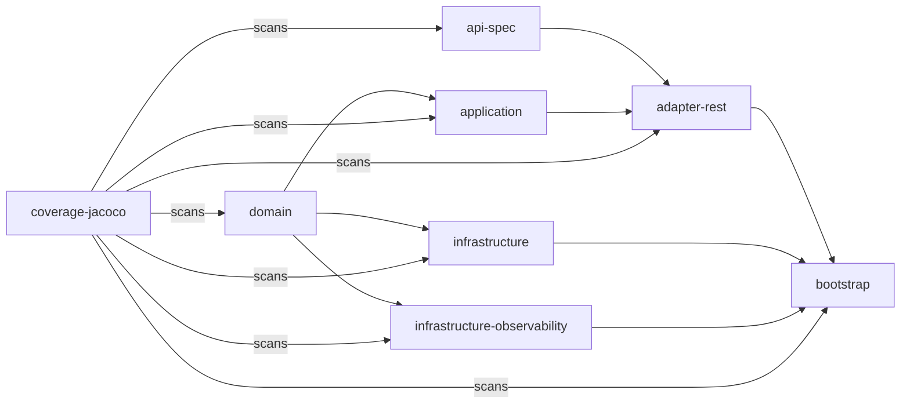
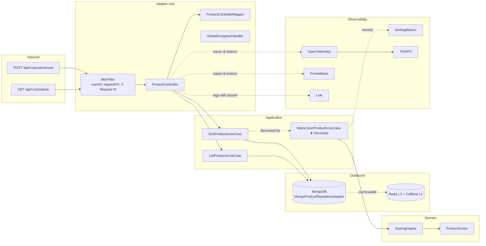

[](LICENSE)

<p align="center">
  <a href="https://sonarcloud.io/summary/new_code?id=acidtango_product-sorter"></a>
  <a href="https://sonarcloud.io/summary/new_code?id=acidtango_product-sorter"></a>
  <a href="https://sonarcloud.io/summary/new_code?id=acidtango_product-sorter"></a>
  <a href="https://sonarcloud.io/summary/new_code?id=acidtango_product-sorter"></a>
  <a href="https://sonarcloud.io/summary/new_code?id=acidtango_product-sorter"></a>
</p>

<p align="center">
  <a href="https://github.com/acidtango/product-sorter/actions/workflows/ci.yml"></a>
  <a href="https://github.com/acidtango/product-sorter/actions/workflows/pages.yml"></a>
  <a href="https://github.com/acidtango/product-sorter/actions/workflows/release.yml"></a>
</p>

---

<p align="center">
  <a href="https://alistair.cockburn.us/hexagonal-architecture/"></a>
  <a href="https://spring.io/projects/spring-boot"></a>
  <a href="https://www.mongodb.com/"></a>
  <a href="https://redis.io/"></a>
  <a href="https://openid.net/connect/"></a>
  <a href="https://opentelemetry.io/"></a>
  <a href="https://www.openapis.org/"></a>
</p>

---

**Product Sorter** is a REST service that sorts a product catalog by weighted scoring criteria (sales units, stock ratio). Built with hexagonal (ports & adapters) architecture on Java 25, Spring Boot 4.1, and Maven multi-module.

---

## Architecture

### Modules

| Module | Description |
|--------|-------------|
| `api-spec` | OpenAPI 3.1 contract to generated Spring interfaces via openapi-generator |
| `domain` | Pure Java. Zero framework dependencies. VOs, Aggregate, Domain Services, Ports |
| `application` | Use case implementations orchestrating domain logic through ports |
| `adapter-rest` | REST controller, DTO mapping, OAuth2 security, OpenAPI docs, exception handling |
| `infrastructure` | MongoDB persistence adapter, L1 Caffeine + L2 Redis caching |
| `infrastructure-observability` | Micrometer business metrics, OTel tracing, MDC logging filter |
| `bootstrap` | Spring Boot composition root. Wires modules, application config |
| `testdata` | CLI tool for generating 50k realistic products (power-law distribution) |
| `coverage-jacoco` | JaCoCo aggregated coverage + ArchUnit hexagonal architecture tests (12 rules) |

### Dependency Graph



### Layer Constraints

- `domain` is pure Java — zero Spring imports. Enforced by ArchUnit.
- `application` depends only on `domain` (no framework, no infrastructure).
- `infrastructure` depends only on `domain` (outbound adapters: persistence, cache).
- `infrastructure-observability` depends on `domain` (metrics decorator, MDC filter).
- `adapter-rest` depends on `api-spec`, and `domain` (inbound adapter).
- `bootstrap` is the composition root.

### Sorting Strategy

```mermaid
flowchart LR
    subgraph Strategy
        SC[SortingCriterion]
        SU[SalesUnitsCriterion<br/>sales / maxSales]
        SR[StockRatioCriterion<br/>sizesWithStock / 3]
        WC[WeightedCriterion] ★ Decorator
    end
    subgraph Domain Services
        PS[ProductScorer<br/>Σ weighted scores]
        SE[SortingEngine<br/>load → score → sort]
    end
    SC --> SU & SR
    SU & SR -.->|wrapped by| WC
    WC --> PS --> SE
```

### Data Flow



### Caching (L1 + L2)

```
score(key) → Caffeine (30s TTL, max 1000) → Redis (5min TTL)
```

Cache keys: `product:score:{id}:{criterion}`, `product:maxSales`, `product:catalog:version`.

Invalidation via `@CacheEvict(allEntries=true)` + versioned catalog.

### Pagination

All collection endpoints return paginated responses with offset-based pagination (1-indexed):

```json
{
  "data": [...],
  "page": 1,
  "size": 20,
  "total": 50000,
  "totalPages": 2500
}
```

### Business Metrics (Micrometer)

| Metric | Type | Tags | Description |
|--------|------|------|-------------|
| `sorting_requests_total` | Counter | — | Total sort requests |
| `sorting_duration_seconds` | Timer (p50, p95, p99) | — | Sort execution time |
| `sorting_products` | DistributionSummary (p50, p95, p99) | — | Products per sort |
| `sorting_weights` | DistributionSummary | `criterion` | Sales/stock weights used |

---

## Quick Start

```bash
# Prerequisites: JDK 25, Maven 3.9+, Docker
git clone https://github.com/acidtango/product-sorter.git
cd product-sorter
```

### Build & Test

```bash
mvn clean verify                                   # Full CI: test + coverage + checkstyle + enforcer
mvn test -pl domain                                # Domain unit tests
mvn test -pl application -am                       # Application tests
mvn test -pl adapter-rest -am                      # Adapter tests
mvn test -pl infrastructure -am                    # Integration tests (MongoDB via Testcontainers)
mvn test -pl coverage-jacoco -am                   # ArchUnit architecture tests (12 rules)
mvn clean verify -Psecurity                        # With OWASP Dependency-Check
```

### Run (full stack)

```bash
docker compose up -d
mvn package -pl bootstrap -am -DskipTests
java -jar bootstrap/target/bootstrap-*.jar --spring.profiles.active=docker
```

### Generate test data (50k products)

```bash
mvn package -pl testdata -am -DskipTests
java -jar testdata/target/testdata-*.jar 50000 /tmp/seed.json --seed 42
```

### API Examples

```bash
# Get JWT from keycloak
TOKEN=$(curl -s -X POST http://localhost:8081/realms/product-sorter/protocol/openid-connect/token \
  -d "client_id=app" -d "username=user" -d "password=pass" -d "grant_type=password" \
  | jq -r '.access_token')

# List products (paginated)
curl -s "http://localhost:8080/api/v1/products?page=1&size=10" \
  -H "Authorization: Bearer $TOKEN" | jq

# Sort products with weighted criteria
curl -s -X POST "http://localhost:8080/api/v1/products/sort?page=1&size=20" \
  -H "Authorization: Bearer $TOKEN" \
  -H "Content-Type: application/json" \
  -d '{"weights": {"salesUnits": 0.7, "stockRatio": 0.3}}' | jq
```

---

## API

| Method | Path | Auth | Description |
|--------|------|------|-------------|
| `GET` | `/api/v1/products` | Bearer JWT | List products (paginated: `page`, `size`) |
| `POST` | `/api/v1/products/sort` | Bearer JWT | Sort products by weighted criteria (paginated) |
| `GET` | `/swagger-ui.html` | No | OpenAPI docs (SpringDoc) |
| `GET` | `/actuator/health` | No | Health check |
| `GET` | `/actuator/prometheus` | No | Prometheus metrics |

### Sort Request

```json
POST /api/v1/products/sort?page=1&size=20
{
  "weights": {
    "salesUnits": 0.7,
    "stockRatio": 0.3
  }
}
```

### Sort Response

```json
{
  "data": [
    { "id": 5,  "name": "CONTRASTING LACE T-SHIRT",  "score": 0.87 },
    { "id": 1,  "name": "V-NECK BASIC SHIRT",         "score": 0.31 },
    { "id": 3,  "name": "RAISED PRINT T-SHIRT",        "score": 0.27 },
    { "id": 2,  "name": "CONTRASTING FABRIC T-SHIRT",  "score": 0.24 },
    { "id": 6,  "name": "SLOGAN T-SHIRT",              "score": 0.21 },
    { "id": 4,  "name": "PLEATED T-SHIRT",             "score": 0.16 }
  ],
  "page": 1,
  "size": 20,
  "total": 6,
  "totalPages": 1
}
```

### List Products Response

```json
GET /api/v1/products?page=1&size=10
{
  "data": [
    { "id": 1, "name": "V-NECK BASIC SHIRT", "salesUnits": 100, "stock": [
      { "size": "S", "quantity": 4 }, { "size": "M", "quantity": 9 }, { "size": "L", "quantity": 0 }
    ]},
    { "id": 5, "name": "CONTRASTING LACE T-SHIRT", "salesUnits": 650, "stock": [
      { "size": "S", "quantity": 0 }, { "size": "M", "quantity": 1 }, { "size": "L", "quantity": 0 }
    ]}
  ],
  "page": 1,
  "size": 10,
  "total": 6,
  "totalPages": 1
}
```

---

## Testing

| Type | Tools | Cases |
|------|-------|-------|
| Unit | JUnit 5 + Instancio + AssertJ | 30 (domain model + services) |
| Application | JUnit 5 + Mockito | 7 (use cases with pagination) |
| Integration | Testcontainers (MongoDB 8) | 6 (persistence mapping) |
| Adapter | Mockito | 6 (controller + mapper) |
| Architecture | ArchUnit | 12 hexagonal boundary rules |

All tests use `@ParameterizedTest(name = "{0}")` with `Named.named()` and `Arguments.arguments()`. Data generation via Instancio. Assertions via AssertJ with `.as("description")`.

---

## Quality

| Tool | Phase | Fails build? |
|------|-------|-------------|
| JaCoCo | verify | Yes (<85% instruction, <80% branch) |
| ArchUnit | test | Yes (12 rules) |
| Checkstyle | validate | No (reports only, no Javadoc enforcement) |
| OpenRewrite | process-sources | No (dry-run) |
| Enforcer | validate | Yes (Java 25, Maven 3.9+, no duplicates) |
| Commitlint | PR | Yes (Conventional Commits, excludes dependabot) |
| OWASP Dep-Check | verify (with `-Psecurity`) | Yes (CVSS ≥ 7) |

---

## CI/CD

| Workflow | Trigger | Description |
|----------|---------|-------------|
| `ci.yml` | PR to `develop` | `mvn verify` + SonarCloud + dependency review |
| `pages.yml` | Push to `develop` | Maven site + coverage reports to GitHub Pages |
| `release.yml` | Tag `v*` | Changelog generation + GitHub release |
| `commitlint.yml` | PR to `develop` | Conventional Commits validation (excludes dependabot) |
| `codeql.yml` | PR + push to `develop` + weekly | GitHub CodeQL security analysis |
| `dependabot.yml` | Weekly | Maven, Docker, Compose, Actions updates |

---

## Observability

| Service | Port | Credentials |
|---------|------|-------------|
| Grafana | 3000 | admin/admin |
| Prometheus | 9090 | — |
| Tempo | 3200 | — |
| Loki | 3100 | — |
| Keycloak | 8081 | admin/admin |

Grafana dashboards include: Sort Requests counter, Sort Duration (p50/p95/p99), Products per Sort, Weights Distribution, JVM Memory, HTTP Requests, Cache Hit Ratio, Traces (Tempo), Application Logs (Loki).

Logs include MDC context: `traceId`, `requestUri`, and `requestId` (from `X-Request-Id` header). Correlatable with Tempo traces via `traceId`.

---

## Design Decisions

### POST vs GET for sorting

`POST /api/v1/products/sort` uses POST because sorting is a computational operation (scoring + ordering), not a resource retrieval. The weights map would be fragile as query parameters and would not scale with additional criteria.

For simple listing without sorting, use `GET /api/v1/products`.

### Pagination

Offset-based pagination with `page` (1-indexed, default 1) and `size` (max 100). Chosen over cursor-based because products are not inserted/deleted during navigation (stable collection) and client implementation is simpler.

### Hexagonal architecture with decorators

`MetricsSortProductsUseCase` decorates `SortProductsUseCase` without modifying domain or application code. Metrics are an infrastructure concern that wraps the use case transparently.

### MDC correlation

`MdcFilter` injects `traceId` (from OTel or generated), `requestUri`, and `X-Request-Id` header into SLF4J MDC. Promtail ships logs to Loki, where they can be correlated with Tempo traces via `traceId`.

---

## Conventional Commits

```
<type>(<scope>): <lowercase subject>

Types: feat | fix | docs | style | refactor | perf | test | build | ci | chore | revert
Scopes: api-spec | domain | application | infrastructure | infrastructure-observability | adapter-rest | bootstrap | testdata | coverage | docker | ci | config

Examples:
  feat(domain): add stock ratio scoring criterion
  test(domain): parametrize sorting engine with Instancio
  ci(workflows): add commitlint validation
