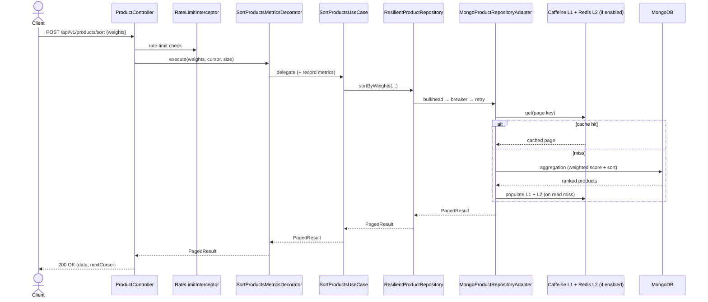
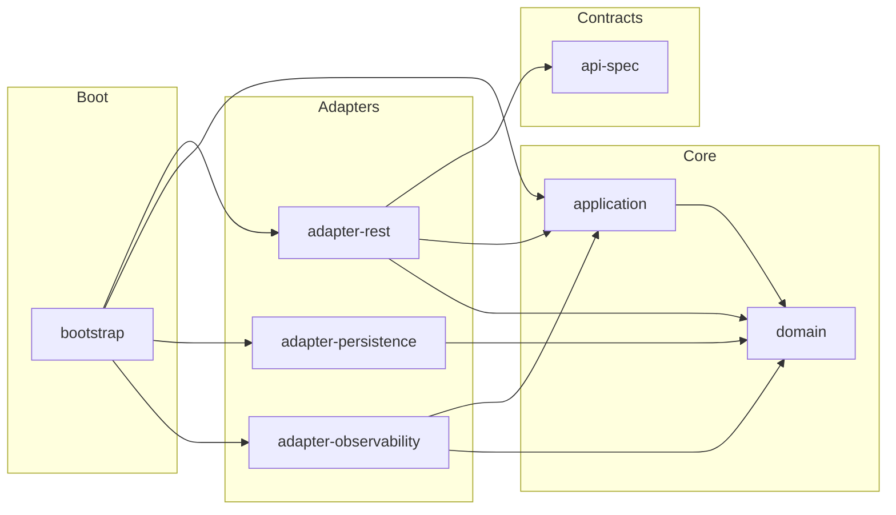
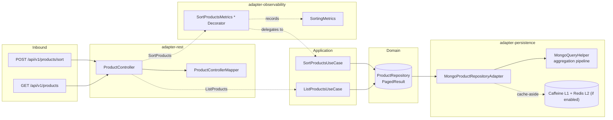
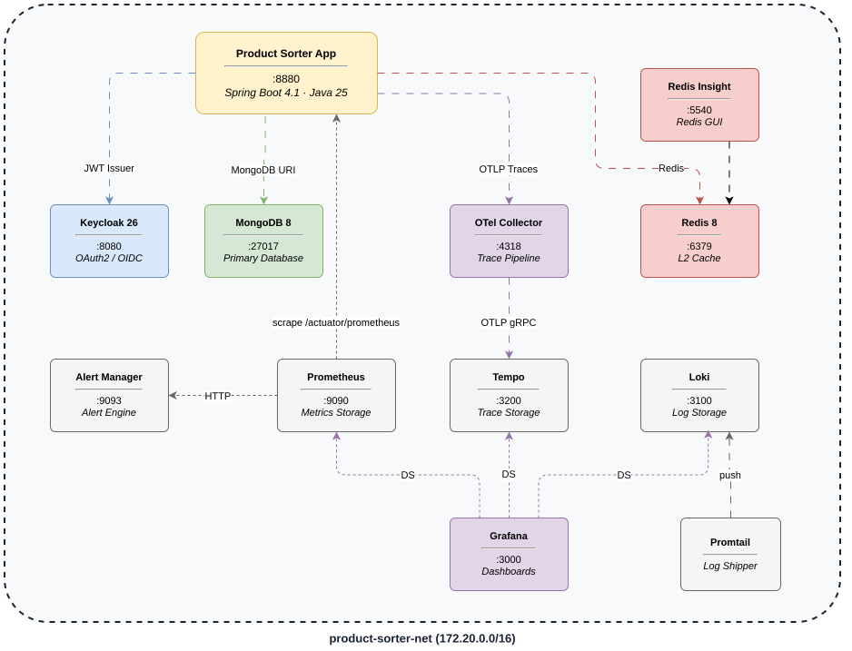
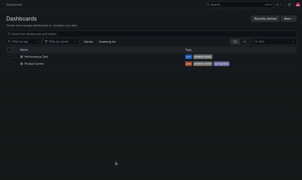

[](https://juanpablojimenezesclusa.github.io/product-sorter/)
[](LICENSE)

<p align="center">
  <a href="https://sonarcloud.io/summary/new_code?id=JuanPabloJimenezEsclusa_product-sorter"></a>
  <a href="https://sonarcloud.io/summary/new_code?id=JuanPabloJimenezEsclusa_product-sorter"></a>
  <a href="https://sonarcloud.io/summary/new_code?id=JuanPabloJimenezEsclusa_product-sorter"></a>
  <a href="https://sonarcloud.io/summary/new_code?id=JuanPabloJimenezEsclusa_product-sorter"></a>
  <a href="https://sonarcloud.io/summary/new_code?id=JuanPabloJimenezEsclusa_product-sorter"></a>
</p>

<p align="center">
  <a href="https://github.com/JuanPabloJimenezEsclusa/product-sorter/actions/workflows/ci.yml"></a>
  <a href="https://github.com/JuanPabloJimenezEsclusa/product-sorter/actions/workflows/pages.yml"></a>
  <a href="https://github.com/JuanPabloJimenezEsclusa/product-sorter/actions/workflows/codeql.yml"></a>
  <a href="https://github.com/JuanPabloJimenezEsclusa/product-sorter/actions/workflows/chaos.yml"></a>
</p>

---

<p align="center">
  <a href="https://alistair.cockburn.us/hexagonal-architecture/"></a>
  <a href="https://www.openapis.org/"></a>
  <a href="https://spring.io/projects/spring-boot"></a>
  <a href="https://www.mongodb.com/"></a>
  <a href="https://redis.io/"></a>
  <a href="https://openid.net/connect/"></a>
  <a href="https://opentelemetry.io/"></a>
</p>

---

**Product Sorter** is a REST service that sorts a product catalog by weighted scoring criteria. Built with hexagonal (ports & adapters) architecture on Java, Spring Boot, and Maven multi-module.

---

## Overview

A product category (t-shirts) must be ordered by business relevance: a **weighted sum** of **sales units** and **stock availability across sizes**, with caller-supplied weights and room for new criteria. The catalog lives in MongoDB and scores are computed server-side in a MongoDB aggregation pipeline. See it on the sample catalog in [Scoring Algorithm → Step-by-step Example](#step-by-step-example).

### Request Flow


```mermaid
sequenceDiagram
    actor Client
    participant API as ProductController
    participant RL as RateLimitInterceptor
    participant DEC as SortProductsMetricsDecorator
    participant UC as SortProductsUseCase
    participant RES as ResilientProductRepository
    participant ADPT as MongoProductRepositoryAdapter
    participant Cache as Caffeine L1 + Redis L2 (if enabled)
    participant Mongo as MongoDB

    Client->>API: POST /api/v1/products/sort {weights}
    API->>RL: rate-limit check
    API->>DEC: execute(weights, cursor, size)
    DEC->>UC: delegate (+ record metrics)
    UC->>RES: sortByWeights(...)
    RES->>ADPT: bulkhead → breaker → retry
    ADPT->>Cache: get(page key)
    alt cache hit
        Cache-->>ADPT: cached page
    else miss
        ADPT->>Mongo: aggregation (weighted score + sort)
        Mongo-->>ADPT: ranked products
        ADPT->>Cache: populate L1 + L2 (on read miss)
    end
    ADPT-->>RES: PagedResult
    RES-->>UC: PagedResult
    UC-->>DEC: PagedResult
    DEC-->>API: PagedResult
    API-->>Client: 200 OK {data, nextCursor}
```

## Requirements Traceability

**Core requirements**

| Requirement | Decision | Where |
|-------------|----------|-------|
| Weighted-sum sorting, extensible criteria | Composition of weighted criteria (`AppliedWeights`, `Metrics`) | [Scoring Algorithm](#scoring-algorithm) |
| Sales-units & stock-ratio criteria | Logistic sales ratio + size-availability ratio | [Scoring Algorithm](#scoring-algorithm) |
| Weights received via REST | `POST /api/v1/products/sort` | [ADR-0005](docs/adr/0005-api-design-post-vs-get-and-pagination.md) |
| Java 8+, Spring Boot | Java 25, Spring Boot 4.1 | `pom.xml` |
| Rich domain, no anemia (VOs, Aggregate, services) | Pure `domain` module | [Layer Constraints](#layer-constraints) |
| Hexagonal + tactical DDD, layer separation | Multi-module + ArchUnit rules | [Modules](#modules), [ADR-0008](docs/adr/0008-pure-hexagonal-adapter-naming.md) |
| Tests: unit / integration / E2E (rest-assured) | Three tiers, representative names | [Testing](#testing) |
| MongoDB persistence | Aggregation-pipeline adapter | [ADR-0001](docs/adr/0001-use-mongodb.md) |
| Patterns in sorting criteria | Weighted-criteria composition | [Scoring Algorithm](#scoring-algorithm) |
| No smells / no Spanish / no dead code | Checkstyle + OpenRewrite + test conventions | [Quality](#quality), [Testing](#testing) |

**Beyond the requirements (extra mile)**

| Capability | Implementation | Where |
|------------|----------------|-------|
| Multi-tier cache (L1 + L2) | Caffeine + Redis, cache-aside | [Caching](#caching-l1--l2), [ADR-0002](docs/adr/0002-use-multi-tier-cache.md) |
| API security | OAuth2 / OIDC resource server | [ADR-0003](docs/adr/0003-use-oauth2-oidc.md) |
| Virtual threads | Project Loom for blocking I/O | [ADR-0004](docs/adr/0004-use-virtual-threads.md) |
| Cursor-based pagination | Opaque `score:id` cursor | [Pagination](#pagination), [ADR-0005](docs/adr/0005-api-design-post-vs-get-and-pagination.md) |
| Observability | Micrometer + OpenTelemetry + MDC (Prometheus / Tempo / Loki / Grafana) | [Business Metrics](#business-metrics-micrometer), [ADR-0007](docs/adr/0007-observability-decorator-and-mdc.md), [ADR-0011](docs/adr/0011-trace-correlation-and-batch-export.md) |
| Resilience | Retry / circuit breaker / bulkhead / rate limiter | [Resilience](#resilience-resilience4j), [ADR-0009](docs/adr/0009-resilience-and-timeout-strategy.md), [ADR-0012](docs/adr/0012-data-access-failure-translation.md) |
| API-first contract | OpenAPI 3.1 → generated Spring interfaces | [Modules](#modules) |
| Quality gates | JaCoCo, ArchUnit, PIT mutation, OWASP, SonarCloud | [Quality](#quality) |
| CI/CD | GitHub Actions (CI, CodeQL, Pages, commitlint), Dependabot | [CI/CD](#cicd) |
| Performance testing | k6 load scenarios (10k → 1M) | [Testing](#testing) |

---

## Architecture

### Modules

| Module | Description |
|--------|-------------|
| `api-spec` | OpenAPI 3.1 contract to generated Spring interfaces via openapi-generator |
| `domain` | Pure Java. Zero framework dependencies. VOs, Aggregate, Metrics, Outbound Ports |
| `application` | Input Ports + use case implementations orchestrating domain logic |
| `adapter-rest` | REST controller, DTO mapping, OAuth2 security, OpenAPI docs, exception handling |
| `adapter-persistence` | MongoDB persistence adapter with aggregation pipeline, L1 Caffeine + L2 Redis caching |
| `adapter-observability` | Metrics decorator, Micrometer business metrics, MdcFilter (traceId, requestUri, X-Request-Id) |
| `bootstrap` | Spring Boot composition root. Wires modules, application config |
| `coverage-jacoco` | JaCoCo aggregated coverage + ArchUnit hexagonal architecture tests |

### Dependency Graph


```mermaid
flowchart LR
  subgraph boot [Boot]
    bootstrap
  end
  
  subgraph contracts [Contracts]
    api-spec
  end

  subgraph core [Core]
    domain
    application
  end

  subgraph adapters [Adapters]
    adapter-rest
    adapter-observability
    adapter-persistence
  end

  application --> domain
  adapter-rest --> api-spec & application & domain
  adapter-persistence --> domain
  adapter-observability --> application & domain
  bootstrap --> adapter-rest & application & adapter-persistence & adapter-observability
```

### Layer Constraints

- `domain` is pure Java — zero Spring imports.
- `application` depends only on `domain` (no framework, no adapters).
- `adapter-persistence` depends only on `domain` (outbound adapter).
- `adapter-observability` depends on `domain` and `application` (metrics decorator wrapping application input ports).
- `adapter-rest` depends on `api-spec`, `application`, and `domain` (inbound adapter).
- `bootstrap` is the composition root.

Enforced by ArchUnit in `coverage-jacoco/src/test/java/.../HexagonalArchitectureTest.java`: `domain` purity, `application` independence, and whitelist rules for `adapter-rest`, `adapter-persistence`, `adapter-observability`, and `api-spec`. Two caveats: the `bootstrap` composition-root rule has no ArchUnit test (convention only), and the `adapter-persistence` whitelist permits Spring Data, MongoDB, Redis, and Caffeine — "depends only on `domain`" means no inner-layer dependency, not zero third-party dependencies.

### Domain Model

```
domain/
├── model/
│   ├── Product              ← Aggregate: id, name, salesUnits, stock, weightedScore (transient)
│   ├── Metrics              ← Enum: SALES_UNITS, STOCK with key mapping and validation
│   └── AppliedWeights       ← Value object: salesUnitsWeight, stockWeight with fromMap()
├── port/
│   └── ProductRepository    ← Outbound port with PagedResult contract
└── vo/
    ├── ProductId, ProductName, SalesUnits, Size, Stock, StockBySize
    └── CursorCodec          ← Base64 cursor encode/decode
```

### Sorting Strategy

Scoring runs in a MongoDB aggregation pipeline for `O(sort)` scalability — the domain does **not** compute scores in memory. The domain defines *what* metrics exist and *how* weights are structured; the adapter translates weights into aggregation stages:

| Responsibility | Layer |
|---------------|-------|
| Metric definitions + weight validation | `domain` (Metrics, AppliedWeights) |
| Raw value at query time (sales ratio; stored `stockRatio`) | `adapter-persistence` (`MongoQueryHelper`) consumes stored `stockRatio` and `salesUnits`; ratio defined by `domain` (`Stock.stockRatio`) |
| Weighted score formula & aggregation | `adapter-persistence` (MongoQueryHelper) |
| Cursor-based pagination | `application` (PagedResult, size+1 detection) |

```javascript
// w_sales=0.7, w_stock=0.3, midpoint=50, cursor=null, size=20
db.products.aggregate([
  // ── Compute weighted score per document ──
  { $addFields: {
    weightedScore: {
      $add: [
        { $multiply: [
          { $divide: ["$salesUnits", { $add: ["$salesUnits", 50] }] },
          0.7
        ]},
        { $multiply: ["$stockRatio", 0.3] }
      ]
    }
  }},

  // ── Sort by score descending (tiebreaker: _id) ──
  { $sort: { weightedScore: -1, _id: -1 } },

  // ── Top-K: heap sort only keeps top N, O(N log K) ──
  { $limit: 21 }  // size+1 to detect hasMore
], { allowDiskUse: true })
```

For cursor-based pagination (second page), a `$match` stage is inserted between `$sort` and `$limit`:

```javascript
{ $match: {
  $or: [
    { weightedScore: { $lt: 0.75 } },
    { weightedScore: 0.75, _id: { $lt: "550e8400-e29b-41d4-a716-446655440000" } }
  ]
}}
```

Pagination uses `nextCursor` (null = end of results) instead of a `total` count, avoiding an extra collection scan per request. MongoDB's `$sort` + `$limit` keeps only an in-memory heap of size K instead of sorting the whole collection.

### Data Flow


```mermaid
flowchart LR
  subgraph Inbound
    POST["POST /api/v1/products/sort"]
    GET["GET /api/v1/products"]
  end
  
  subgraph adapter-rest
    C[ProductController]
    M[ProductControllerMapper]
  end

  subgraph Application
    SUC[SortProductsUseCase]
    LUC[ListProductsUseCase]
  end
    
  subgraph Domain
    REPO[(ProductRepository<br/>PagedResult)]
  end
    
  subgraph adapter-persistence
    HLP[MongoQueryHelper<br/>aggregation pipeline]
    ADPT[MongoProductRepositoryAdapter]
    CACHE[("Caffeine L1 + Redis L2 (if enabled)")]
  end
    
  subgraph adapter-observability
    MM[SortProductsMetrics * Decorator]
    SM[SortingMetrics]
  end

  POST & GET --> C --> M
  C -.->|SortProducts| MM
  C -.->|ListProducts| LUC
  MM -.->|delegates to| SUC --> REPO
  LUC --> REPO
  REPO --> ADPT --> HLP
  ADPT -.->|cache-aside| CACHE
  MM -.->|records| SM
```

### Caching (L1 + L2)

```
get(k) → Caffeine (30s TTL, max 100) → miss → Redis L2 (300s TTL, if enabled) → miss → MongoDB
```

`MultiTierCache` wraps Caffeine (L1) and Redis (L2); Redis is wired only when `cache.redis.enabled=true` (docker-compose profile and chaos tests; off by default and under the `aws` profile). An L2 hit populates L1, a miss populates both tiers. The catalog repository port is read-only — no save/evict path; entries are populated cache-aside by reads only. Cache namespace: `productCache`. First-page requests (cursor=null) are cached: list key `page-<limit>`, sort key `<salesUnitsWeight>-<stockWeight>-<limit>`. Later pages with unique cursors bypass the cache.

### Pagination

Both endpoints use cursor-based pagination instead of offset-based (`$skip`), so page access stays `O(1)` at any depth:

| Field | Description |
|-------|-------------|
| `cursor` | Base64-encoded `score:productId` (optional, null = first page) |
| `size` | Items per page (default 20, max 100) |
| `nextCursor` | Opaque token for next page (null = last page) |

The repository returns `size + 1` items. The use case detects `hasMore` when result exceeds `size`, trims the extra item, and computes `nextCursor` from the last visible product.

### Business Metrics (Micrometer)

| Metric | Type | Tags | Description |
|--------|------|------|-------------|
| `sorting_requests_total` | Counter | — | Total sort requests |
| `sorting_duration_seconds` | Timer (p50, p95, p99) | — | Sort execution time |
| `sorting_products` | DistributionSummary (p50, p95, p99) | — | Products per sort |
| `sorting_weights` | DistributionSummary | `criterion` | Sales/stock weights used |

MDC `traceId` is the active span's 32-hex trace id, so Loki logs join Tempo traces. `TracingFilter` creates **exactly one SERVER span per request** — an enforced invariant asserted by `TracingSpanCountTest` ([ADR-0011](docs/adr/0011-trace-correlation-and-batch-export.md)).

### Resilience (Resilience4j)

Fault tolerance is applied at each outbound boundary as **decorators**, keeping domain/application framework-free:

| Boundary | Strategy | Degradation |
|----------|----------|-------------|
| MongoDB (`ResilientProductRepository`) | Bulkhead → CircuitBreaker → Retry | Open/full → fail fast `503`; data-access failure (exhausted retry, query timeout) → `503` ([ADR-0012](docs/adr/0012-data-access-failure-translation.md)) |
| Redis L2 (`ResilientCache`) | CircuitBreaker | Open → cache miss (fall back to MongoDB) |
| JWKS fetch (`JwtDecoderResilienceConfig`) | Retry + timeouts | Transient fetch retried |
| REST ingress (`RateLimitInterceptor`) | RateLimiter | Over limit → `429` |

Retry covers connectivity/failover only (never timeouts); the breaker is time-based and slow-call-aware; the bulkhead sits above concurrency and below the Mongo pool.

---

## Scoring Algorithm

Products are sorted by a weighted sum of two criteria, both normalized to [0, 1]; final scores are computed in MongoDB via an aggregation pipeline.

### Criterion: Sales Units

```
salesRatio(product) = product.salesUnits / (product.salesUnits + midpoint)
```

Uses logistic normalization (`x / (x + K)`) with configurable `midpoint` (default 50). At `salesUnits = midpoint`, the ratio is 0.5. ∈ [0, 1). No dependency on max sales or the full dataset.

### Criterion: Stock Ratio

```
stockRatio(product) = count(sizes where quantity > 0) / totalSizes()
                      0 if stock is empty
```

Measures size availability: what fraction of the product's sizes are in stock. ∈ [0, 1].

### Weighted Sum

```
weightedScore(product) = w_sales × salesRatio + w_stock × stockRatio
```

### Step-by-step Example

Using the dataset with `weights = { salesUnits: 0.7, stockRatio: 0.3 }` and `midpoint = 50`:

| # | Name | Sales | S | M | L | Sales Ratio | Stock Ratio | Weighted Score |
|---|------|-------|----|----|----|-------------|-------------|----------------|
| 1 | V-NECH BASIC SHIRT | 100 | 4 | 9 | 0 | 100/(100+50) = 0.667 | 2/3 | 0.7×0.667 + 0.3×(2/3) = **0.667** |
| 2 | CONTRASTING FABRIC T-SHIRT | 50 | 35 | 9 | 9 | 50/(50+50) = 0.500 | 3/3 = 1.0 | 0.7×0.500 + 0.3×1.0 = **0.650** |
| 3 | RAISED PRINT T-SHIRT | 80 | 20 | 2 | 20 | 80/(80+50) = 0.615 | 3/3 = 1.0 | 0.7×0.615 + 0.3×1.0 = **0.731** |
| 4 | PLEATED T-SHIRT | 3 | 25 | 30 | 10 | 3/(3+50) = 0.057 | 3/3 = 1.0 | 0.7×0.057 + 0.3×1.0 = **0.340** |
| 5 | CONTRASTING LACE T-SHIRT | 650 | 0 | 1 | 0 | 650/(650+50) = 0.929 | 1/3 | 0.7×0.929 + 0.3×(1/3) = **0.750** |
| 6 | SLOGAN T-SHIRT | 20 | 9 | 2 | 5 | 20/(20+50) = 0.286 | 3/3 = 1.0 | 0.7×0.286 + 0.3×1.0 = **0.500** |

**Sorted result (descending score):** CONTRASTING LACE T-SHIRT 0.750 → RAISED PRINT T-SHIRT 0.731 → V-NECH BASIC SHIRT 0.667 → CONTRASTING FABRIC T-SHIRT 0.650 → SLOGAN T-SHIRT 0.500 → PLEATED T-SHIRT 0.340.

---

## Quick Start

```bash
# Prerequisites: JDK 25, Maven 3.9+, Docker
git clone https://github.com/JuanPabloJimenezEsclusa/product-sorter.git
cd product-sorter
```

### Build & Test

```bash
mvn clean verify                     # Full CI: test + coverage + checkstyle + enforcer
mvn test -pl domain                  # Domain unit tests (PIT only with -Ppitest)
mvn test -P pitest -pl domain        # PIT mutation testing
mvn test -pl application -am         # Application tests
mvn test -pl adapter-rest -am        # Adapter tests
mvn test -pl adapter-persistence -am # Integration tests (MongoDB via Testcontainers)
mvn test -pl coverage-jacoco -am     # ArchUnit architecture tests
mvn clean verify -Psecurity          # With OWASP Dependency-Check
```

### Docker Compose Deployment

#### Option 1 — Local dev (app on host)

```bash
mvn package -pl bootstrap -am -DskipTests
java -jar bootstrap/target/bootstrap-*.jar --spring.profiles.active=docker-compose
```

#### Option 2 — Fully containerized (Docker Compose)

```bash
docker compose --profile app up --detach --build
```

#### Architecture



| Service                               | Auth                  |
|---------------------------------------|-----------------------|
| [API](http://localhost:8880)          | Bearer JWT (Keycloak) |
| [Grafana](http://localhost:3000)      | `admin` / `admin`     |
| [Prometheus](http://localhost:9090)   | —                     |
| [Alertmanager](http://localhost:9093) | —                     |
| [Keycloak](http://localhost:8081)     | `admin` / `admin`     |
| [RedisInsight](http://localhost:5540) | —                     |



### AWS Deployment

Production-ready ECS Fargate stack — CloudFormation (3 stacks), Cognito, Secrets Manager, ALB + ACM + Route53, VPC with NAT Gateway, FARGATE_SPOT. ~$70/month. See [deploy/aws/](deploy/aws/Readme.md).

### Generate test data

```bash
# Args: <count> <output.json> — e.g. 250000 products
mvn test-compile exec:java -pl adapter-persistence \
  -Dexec.mainClass="dev.jpje.productsorter.adapter.persistence.datagen.ProductDataGenerator" \
  -Dexec.classpathScope=test \
  -Dexec.args="250000 /tmp/products.json"
```

---

## API

| Method | Path | Auth | Description |
|--------|------|------|-------------|
| `POST` | `/api/v1/products/sort` | Bearer JWT | Sort products by weighted criteria (cursor-based pagination) |
| `GET` | `/api/v1/products` | Bearer JWT | List products (cursor-based pagination) |

### Error Statuses

| Status | When | Message (stable, generic) |
|--------|------|---------------------------|
| `400` | Malformed body, type mismatch, missing parameter, validation or constraint violation | `Invalid request` |
| `401` | Missing or invalid JWT | `Unauthorized` |
| `404` | Unknown path | `Resource not found` |
| `405` | Unsupported HTTP method | `Method not allowed` |
| `415` | Non-JSON request body | `Unsupported media type` |
| `429` | Rate limiter exhausted | `Too many requests, please retry later` |
| `500` | Unhandled, non-data-access failure | `An unexpected error occurred` |
| `503` | Breaker open, bulkhead full, or data-access failure (exhausted retry, query timeout) | `Service temporarily unavailable, please retry later` |

Errors carry `ErrorResponse {status, code, message, timestamp}`; messages never contain raw exception text — detail is logged server-side only.

### Sort Request

```bash
TOKEN=$(curl -s -X POST http://localhost:8081/realms/product-sorter/protocol/openid-connect/token \
  -d "client_id=product-sorter-client" -d "client_secret=product-sorter-secret" \
  -d "username=user" -d "password=pass" -d "grant_type=password" | jq -r '.access_token')

# First page (no cursor)
curl -s -X POST "http://localhost:8880/api/v1/products/sort?size=20" -H "Authorization: Bearer ${TOKEN}" \
  -H "Content-Type: application/json" -d '{"weights": {"salesUnits": 0.7, "stockRatio": 0.3}}' | jq

# Next page (with cursor from previous response)
curl -s -X POST "http://localhost:8880/api/v1/products/sort?cursor=...&size=20" -H "Authorization: Bearer ${TOKEN}" \
  -H "Content-Type: application/json" -d '{"weights": {"salesUnits": 0.7, "stockRatio": 0.3}}' | jq
```

### Sort Response

```json
{
  "data": [
    {
      "id": "550e8400-e29b-41d4-a716-446655440000",
      "name": "CONTRASTING LACE T-SHIRT",
      "salesUnits": 650,
      "stock": [
        { "size": "S", "quantity": 0 },
        { "size": "M", "quantity": 1 },
        { "size": "L", "quantity": 0 }
      ],
      "score": 0.75
    }
  ],
  "size": 20,
  "nextCursor": "MC43NTo1NTBlODQwMC1lMjliLTQxZDQtYTcxNi00NDY2NTU0NDAwMDA="
}
```

### List Products Request

```bash
# First page
curl -s "http://localhost:8880/api/v1/products?size=10" -H "Authorization: Bearer ${TOKEN}" | jq

# Next page
curl -s "http://localhost:8880/api/v1/products?cursor=...&size=10" -H "Authorization: Bearer ${TOKEN}" | jq
```

### List Products Response

Same envelope as the sort response — `data`, `size`, `nextCursor` — but without `score`.

Fields whose value is `null` (such as `score`, populated only by the sort endpoint) are omitted from the JSON because `spring.jackson.default-property-inclusion: non_null` is set.

---

## Testing

| Type | Tools | Cases |
|------|-------|-------|
| Unit | JUnit 5 + Instancio + AssertJ | domain model + value objects |
| Unit (mutation) | PIT Mutation Testing | mutation score on domain |
| Application | JUnit 5 + Instancio + Mockito | use cases with cursor pagination |
| Integration | Testcontainers (MongoDB 8) | aggregation pipeline + pagination + mapper |
| Cache | Mockito | MultiTierCache + CompositeCacheManager |
| Resilience | JUnit 5 + Resilience4j | retry, circuit breaker, bulkhead, rate limiter |
| Observability | Mockito + Micrometer | metrics, decorator, MDC filter |
| Adapter | Mockito | controller + mapper |
| Architecture | ArchUnit | hexagonal boundary rules |
| E2E | Testcontainers + REST Assured | full HTTP stack: sort + paginate with cursor |
| Contract | REST Assured + JSON Schema | API response matches OpenAPI spec |
| Chaos | Testcontainers + Toxiproxy + MockWebServer | fault injection: fail-fast, degradation, recovery (`-Pchaos`, [chaos/](chaos/README.md)) |
| Performance | k6 | Load scenarios (10k, 100k, 1M products), see [perf/](perf/) |

---

## Quality

| Tool | Phase | Fails build? |
|------|-------|--------------|
| JaCoCo | verify | Yes (>85% instruction, >80% branch) |
| ArchUnit | test | Yes |
| Checkstyle | validate | No (reports only) |
| OpenRewrite | Manual (`mvn rewrite:dryRun`) | No (`failOnDryRunResults=false`) |
| Enforcer | validate | Yes (Java 25, Maven 3.9+, no duplicates) |
| Commitlint | PR | Yes (Conventional Commits) |
| OWASP Dep-Check | Manual (`mvn verify -Psecurity`) | Yes (CVSS >= 7) |
| PIT Mutation | test-compile (with `-Ppitest`) | Yes (>= 70% mutation score) |

---

## CI/CD

| Workflow | Trigger | Description |
|----------|---------|-------------|
| `ci.yml` | Push + PR to `develop` | `mvn verify` + SonarCloud + dependency review |
| `codeql.yml` | PR + push to `develop` + weekly | GitHub CodeQL security analysis |
| `commitlint.yml` | PR to `develop` | Conventional Commits validation |
| `pages.yml` | Push + non-draft PR to `develop` | Maven site + coverage reports to GitHub Pages |
| `dependabot.yml` | Weekly | Maven, Docker, Compose, Actions updates |
| `chaos.yml` | Weekly + manual | Chaos/resilience tests (`-Pchaos`) |

---

## Architecture Decision Records

All significant design decisions are documented as ADRs in [`docs/adr/`](docs/adr/):

| ADR | Title |
|-----|-------|
| [ADR-0001](docs/adr/0001-use-mongodb.md) | Use MongoDB as Primary Database |
| [ADR-0002](docs/adr/0002-use-multi-tier-cache.md) | Use Multi-Tier Cache (Caffeine L1 + Redis L2) |
| [ADR-0003](docs/adr/0003-use-oauth2-oidc.md) | Use OAuth 2.0 / OIDC for API Authentication |
| [ADR-0004](docs/adr/0004-use-virtual-threads.md) | Use Virtual Threads (Project Loom) |
| [ADR-0005](docs/adr/0005-api-design-post-vs-get-and-pagination.md) | API Design — POST for Sorting and Cursor-Based Pagination |
| [ADR-0006](docs/adr/0006-scored-product-composition.md) | Score as Nullable Field on ProductResponse |
| [ADR-0007](docs/adr/0007-observability-decorator-and-mdc.md) | Observability — Decorator Pattern and MDC Correlation |
| [ADR-0008](docs/adr/0008-pure-hexagonal-adapter-naming.md) | Hexagonal Adapter Naming Convention |
| [ADR-0009](docs/adr/0009-resilience-and-timeout-strategy.md) | Resilience — Resilience4j Decorators and Timeout Strategy |
| [ADR-0011](docs/adr/0011-trace-correlation-and-batch-export.md) | Trace Correlation Identity and Batched Span Export |
| [ADR-0012](docs/adr/0012-data-access-failure-translation.md) | Translate Data-Access Failures to Service Unavailable |
